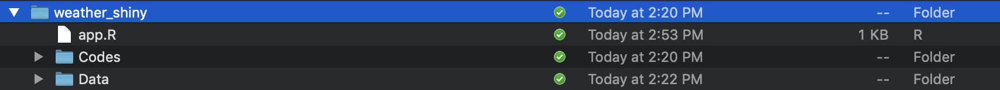

class: middle

```{r, child = './../setup.Rmd'}
```

```{r, include = F, cache = F}
suppressMessages(library(nycflights13)) 
suppressMessages(library(extrafont)) 
suppressMessages(library(patchwork))
```

# Learning objectives

Learn how to use a combination of R packages to generate (mostly) publication-ready articles in WORD 

<br>

<span style="color:red"> Tips: </span>hitting letter "o" key will give you a panel view of the slides

---
class: middle

# What is Shiny? 

+ See [here]() for a list of web applications created using the `shiny` package

+ You need no or only limited knowledge of websites 
  * how html works
  * how css works
  * how to make websites interactive 

---
class: middle

# Folder and file structure

+ create a project folder (name it however you want)
+ inside the folder create a file named `app.R`
+ create a data folder inside the project folder (name it however you want)
  * stores all the datasets you need here

```{r  echo = F, out.width = "90%"}
 
```

---
class: middle

# app.R 

`app.R` consists mainly of three parts:

+ 1st part: preparation 
  * load packages
  * read datasets from the date folder (the working directory is directory `app.R` is stored)
+ 2nd part: define the UI of the application
+ 3rd part: generate objects displayed on the UI based on user inputs 

---
class: middle

# Shiny 

+ `ui`: 
  * create user interface
  * create user input system, which can then be passed to `server` as `input`
  * display the results created in `server` (available to `ui` as `output`)
+ `server`:
  * take the values user entered or selected as `input` 
  * create results to display and make it available to `ui` as output

.left5[

```{r eval = F}
ui <- fluidPage(

  titlePanel("Precipitation"),

  fluidRow(
    column(3, # spans 3 columns
      # place tools to let users select or enter values
    ),
    column(9, # spans 9 columns
      # place results to display here
    )
  )

) 
```
]

.right5[
```{r eval = F}
server <- function(input, output){

  # generate results based on the inputs from the ui side

}  
```
]

---
class: middle

```{r eval = F}
tmax_Jan_09 <- stack("./Data/tmax_Jan_09.tif")

states_ls <- fips_codes$state_name %>% 
  unique() %>% 
  as.list()

states <- readRDS("./Data/state_boundary.rds")
```

---
class: middle
 
.left5[
```{r eval = F}
ui <- fluidPage(

  titlePanel("Precipitation"),

  fluidRow(
    column(3, # spans 3 columns
      selectInput( #<<
        "selected_state", #<<
        h3("Select State"), #<< 
        choices = states_ls, #<<
        selected = states_ls[[1]] #<<
      ) #<<
    ),
    column(9, # spans 9 columns

    )
  )
)  
```
]

.right5[

+ In the UI, an input selector will be created using `selectInput()`

+ `"selected_state"` is the label of the object passed to `server` as an element of `input` in `server`

+ `h3("Select State")` prints `Select State` (formatted as heading 3) in the UI 

+ `choices = states_ls` lists all the values in `states_ls` as selectable values in a dropdown list in the UI

+ `selected = states_ls[[1]]` sets the default value selected (here, Alabama)

]

---
class: middle

.left5[

```{r eval = F}
server <- function(input, output){

  #--- recover state fips code ---#
  state_fp <- fips_codes %>% 
    filter(state_name == `input$selected_state`) %>% 
    pull(state_code) %>% 
    unique()

  #--- get the state boundary sf ---#
  temp_state_sf <- states_sf %>%  
    filter(statefp == state_fp)

  #--- create a map of the selected state ---#
  ggplot() +
    geom_sf(data = temp_state_sf)

}  
```

]

.right5[

+ The values entered or selected by the user are made available to `server` as `input`.

+ As we saw in the previous slide, the state name selected by the user on the UI is labeled as `selected_state` and passed to `server` as an element of `input`, which is a list.

+ `input$selected_state` has the state name selected by the user

+ The code finds state FIPS code of the state name selected by the user (first chunk)

+ It then filters the state boundary `sf` to the state selected by the user (second chunk)

+ The final chunk creates a map of the selected state

]

---
class: middle

You have many input tools:

+ `actionButton`: Action Button
+ `checkboxGroupInput`: A group of check boxes
+ `checkboxInput`: A single check box
+ `dateInput`: A calendar to aid date selection
+ `dateRangeInput`: A pair of calendars for selecting a date range
+ `fileInput`: A file upload control wizard
+ `helpText`: Help text that can be added to an input form
+ `numericInput`: A field to enter numbers
+ `radioButtons`: A set of radio buttons
+ `selectInput`: A box with choices to select from
+ `sliderInput`: A slider bar
+ `submitButton`: A submit button
+ `textInput`: A field to enter text

---
class: middle

.left5[
```{r eval = F}
server <- function(input, output){

  `output$gg_state <- renderPlot({` 

  state_fp <- fips_codes %>% 
    filter(state_name == input$selected_state) %>% 
    pull(state_code) %>% 
    unique()

  temp_state_sf <- states_sf %>%  
    filter(statefp == state_fp)

  ggplot() +
    geom_sf(data = temp_state_sf)

  `})`

}
```
]

.right5[

+ We wrap all the codes that generated a map with `renderPlot({})`, and then save it as `output$gg_state`

+ `gg_state` is available to `ui` as part of the output of `server`.

]

---
class: middle

.left5[
```{r eval = F}
ui <- fluidPage(

  titlePanel("Precipitation"),

  fluidRow(
    column(3, # spans 3 columns
      selectInput(
        "selected_state", 
        h3("Select State"), 
        choices = states_ls, 
        selected = states_ls[[1]]
      )
    ),
    column(9, # spans 9 columns
      `plotOutput("gg_state")`
    )
  )
) 
```
]

.right5[

+ `plotOutput("gg_state")` display `gg_state` on the UI

]

---
class: middle

You have many output options

+ `dataTableOutput`: DataTable
+ `htmlOutput`: raw HTML
+ `imageOutput`: image
+ `plotOutput`: plot
+ `tableOutput`: table
+ `textOutput`: text
+ `uiOutput`: raw HTML
+ `verbatimTextOutput`: text
 
---
class: middle
 
# Start the application

You can use the `runApp()` function to make the application running:

.content-box-green[**Syntax**]

```{r eval = F}
runApp("path to the shiny project") 
```

+ You provide the name of the folder that has `app.R` file (and potentially other supplementary files and folders inside it) 

.content-box-green[**Example**]

```{r eval = F}
setwd("/Users/tmieno2/Dropbox/TeachingUNL/DataScience/LectureNotes/Chapter-10-Shiny")

runApp("weather_daily") 
```


