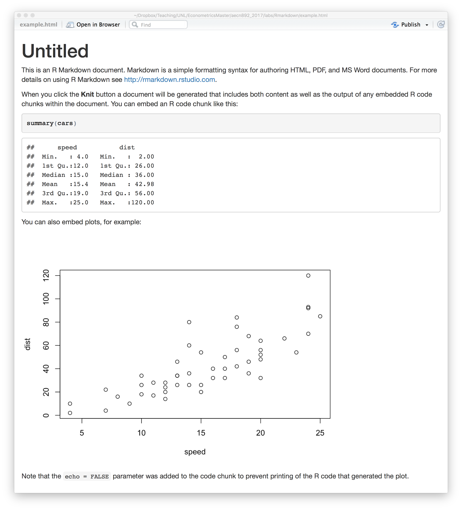
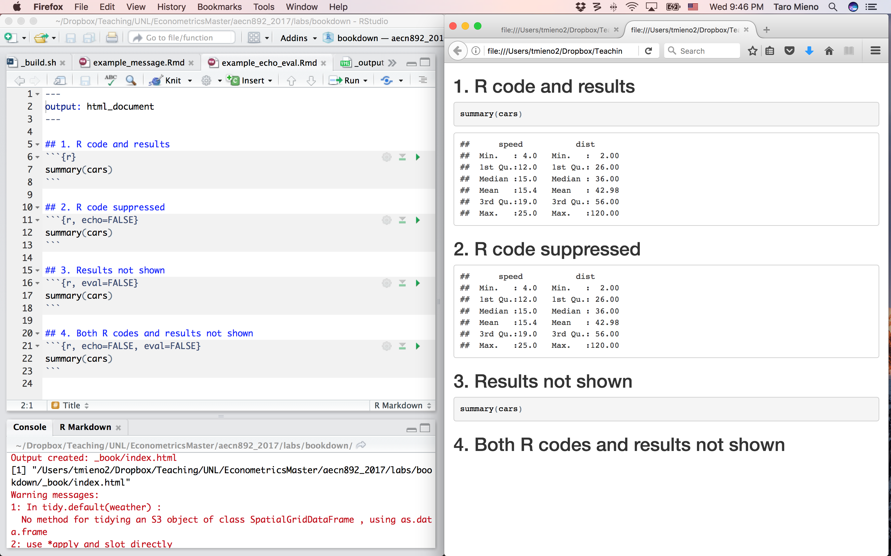
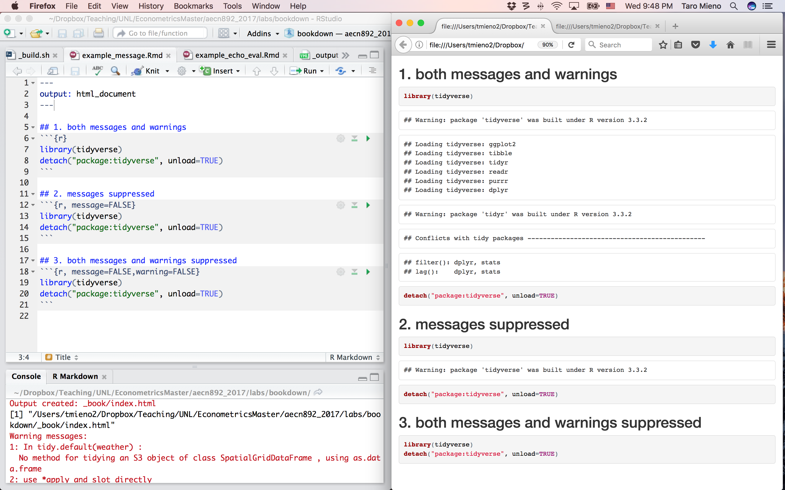
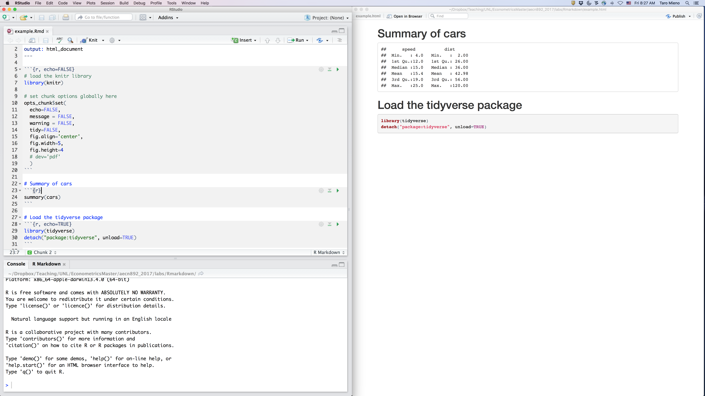
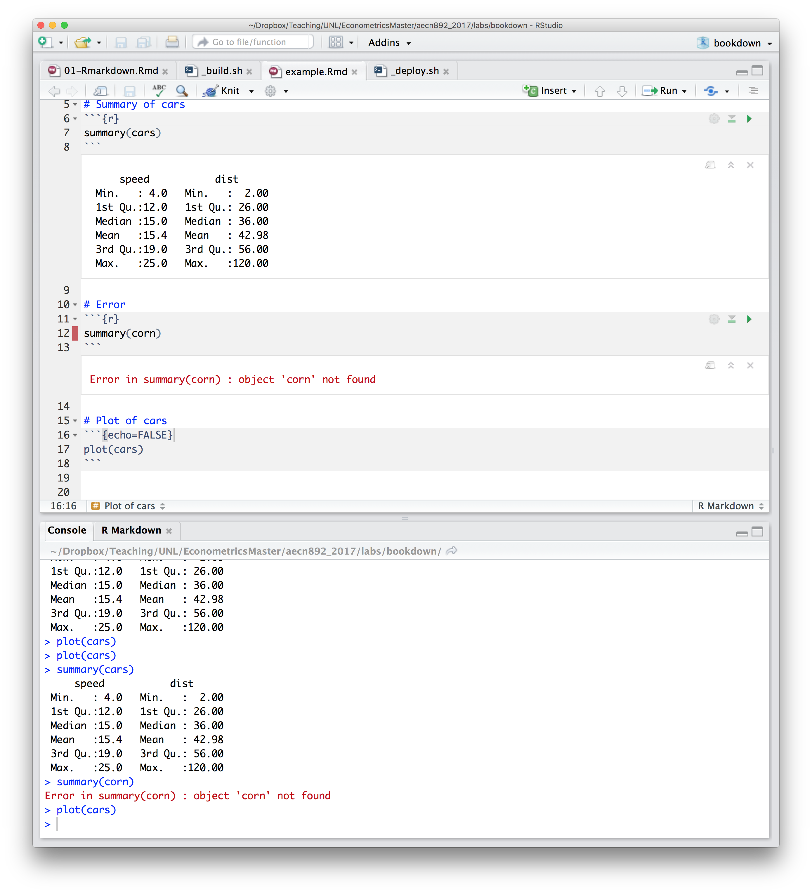
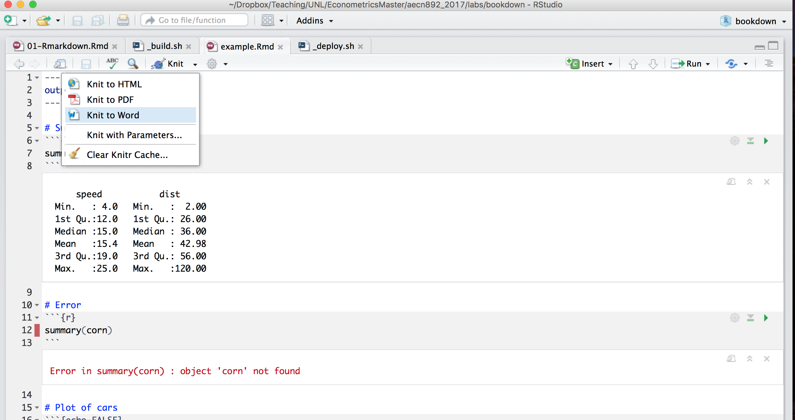

# Reporting with Rmarkdown

------

## What is Rmarkdown?

**Rmarkdown** allows you to effortlessly generate documents that incorporate R codes and their outcomes (This textbook is indeed written using **Rmarkdown**). This can be extremely useful when you report the analysis you conducted and its source R codes to your advisor (or anyone you report to).

If you would like to generate a document with R codes and their results in WORD, it would be a real pain to do so because you need to copy and paste all the R codes you run and the results onto WORD **manually**. Moreover, often times, copied R codes and results are badly formatted when pasting them, and you need to spend quite a bit of time reformatting them. Rmarkdown is basically a system that obviates the need of repeating copying and pasting when you would like to communicate what you did (R codes) and what you found (results).

Before getting into the details of Rmarkdown, I will list some useful resources to learn Rmarkdown. Indeed, what you learn here is bare minimal. For those who are keen to advance your Rmarkdown skills further, the following list of resources are useful.  

+ R Markdown: The Definitive Guide (<https://bookdown.org/yihui/rmarkdown/>)
+ Introduction to R markdown by Rstudio (<http://rmarkdown.rstudio.com/lesson-1.html>)
+ Cheat sheet by Rstudio (<https://www.google.com/url?sa=t&rct=j&q=&esrc=s&source=web&cd=2&ved=0ahUKEwj97pD72vjVAhVk74MKHYBqBMsQFgg0MAE&url=https%3A%2F%2Fwww.rstudio.com%2Fwp-content%2Fuploads%2F2015%2F02%2Frmarkdown-cheatsheet.pdf&usg=AFQjCNHTjjlYFQjxyljotaYc6U4Wagw-CQ>)

In order to use **Rmarkdown**, install the **rmarkdown** package:


```r
install.packages(rmarkdown)
```

## Generating a report using Rmarkdown

Generating a report using Rmarkdown is a two-step process:

1. You write an Rmd file with a mix of regular texts and R codes. You use a special syntax to let the computer know which parts of the file are simple texts and which parts are R codes.

2. Tell the computer to process the Rmd file (a click of a button on Rstudio)
  + The computer runs the R codes and get their outcomes
  + Combine the text parts, R codes, and their results to produce the final document

The biggest difference from WORD is that what you write is what you see as the final document on WORD. However, what you write on an rmarkdown file (file with .Rmd as an extension) will not be what you will see as its resulting final document.

### Basics

So, how can we let the computer know which parts of an Rmd file be recognized as R codes? This is done by placing R codes within a special syntax as in

<pre><code>```{r}
R codes
```</code></pre>

For example, $summary(cars)$ (the R code) is recognized as an R code below,

<pre><code>```{r}
summary(cars)
```</code></pre>

Figure below is a screenshot of an Rmd file opened in Rstudio (upper panel). Notice that R codes $summary(cars)$ and $plot(cars)$ are enclosed individually by the special syntax. So, in this rmd file, R knows that it should treat $summary(cars)$ and $plot(cars)$ as R codes, but not regular texts. On the other hand, any texts that are not enclosed by the special syntax would be recognized as regular text.


Now, by hitting the **Knit** button at the top of the upper panel, you can process this Rmd file to produce a document with the R codes presented and interpreted in it. Below is what the resulting document looks like:



Comparing the two figures will give you a much clearer idea of how Rmarkdown works. First, the first 4 lines represent a YAML header. You don't really need to know what YAML is at this point. Only thing you need to know here is that by specifying options in this header, you can do things like changing the title, output file type, and color scheme of the resulting document. For example, in the sample rmd file, title is set to be **Untitled** and the file type of the output document is **html**. For those who are interested in learning more on options that can be set in the YAML header, take a look at [here](http://rmarkdown.rstudio.com/markdown_document_format.html#overview).

[html format](http://rmarkdown.rstudio.com/html_document_format.html) [pdf format](http://rmarkdown.rstudio.com/pdf_document_format.html).

In lines 6-8, you have regular texts in the rmd file (they are not enclosed by the special syntax). Look how they are exactly the same as what you see in the output document after the title. Rmarkdown does not try to interpret regular texts.

Now, here comes an interesting difference between the rmd and output html file. **summary(cars)** at line 11 is recognized as R codes because it is enclosed by the special syntax. Look how the R code chunk is interpreted and translated into in the output file. First, the exact text of the R code was printed. And then, the outcome of the evaluation of the code is placed below. Realize that you did not have to copy and paste the code or its results manually! This is the beauty of Rmarkdown.

Now, going back to the rmd file, you have another line of regular text at line 14, which appears exactly the same in the output document as expected. We then have another R code chunk in lines 16-18. Look what this chunk was translated into in the output document. It's a plot of dataset called **cars**, the outcome of the evaluation of **plot(cars)**. At this point, you should have gotten the idea. But, notice that the R code was not printed in the output document unlike the previous R code. This is because of **echo=FALSE** in line 16. It tells the computer to NOT print (echo) the R code in the chunk. Indeed, there are lots of **chunk options** you can use to control how R codes are interpreted or displayed.

## Chunk options

There are number of chunk options available. Here, I list some that you may use:

+ __echo__: control whether the R codes appear in the  output document or not
+ __results__: control how the results of the evaluation of the R codes appear in the output document (we will use this option a lot when we report regression results using the **stargazer** package)
+ __eval__: control whether the R codes is evaluated or not
+ __message__: control weather messages associated with R codes evaluation appears in the output document or not
+ __warning__: control weather warnings associated with R codes evaluation appears in the output document or not

For the complete list of chunk options available, check out [Yihui's website](https://yihui.name/knitr/options/) or the [Rstudio Reference Guide](https://www.rstudio.com/wp-content/uploads/2015/03/rmarkdown-reference.pdf).

The following examples should make it clear how you can use options to control your output.

### echo and eval options



### message and warning options



### Specify chunk options globally

By default, the echo option is set $TRUE$. Sometimes, you do not want any of the R codes to appear on the output document. For example, if you are writing a term paper, the instructor may want to see only results, but not R codes. In such cases, it would be painful to type $echo=FALSE$ for every single R code chunk especially when you are writing a long document with lots of R code chunks. Fortunately, you can set chunk options globally so that once you set chunk options, they are effective throughout the document. This can be done using $opts\_chunk\$set()$ from the **knitr** package.

<pre><code>```{r, echo=FALSE}
# load the knitr library
library(knitr)

# set chunk options globally here
opts_chunk$set(
  echo=FALSE,
  message = FALSE,
  warning = FALSE,
  tidy=FALSE,
  fig.align='center',
  fig.width=5,
  fig.height=4
  # dev='pdf'
  )
```</code></pre>

Here is a sample code with the above R code chunk and its output:



Note that in the Rmd file, you see an R code chunk in lines 5-20. In the chunk, it first call _library(knitr)_. We then have $opts\_chunk\$set()$ with lots of options specified inside the parenthesis. Several look familiar. $echo=FALSE$ prevent the R codes from appearing in the output document. The options specified here will be applied globally for the subsequent part of the Rmd file. Note that the chunk with $summary(cars)$ does not print $summary(cars)$ in the output document (right panel) even though you do not have $echo=FALSE$ in the chunk. This is because $echo=FALSE$ option specified above is effective. However, it is possible to counter the option specified in $opts\_chunk\$set()$ locally. In the third R code chunk, $echo=TRUE$ option is added. Consequently, you do see the R codes in the output document on the right. So, you successfully negated the global option of $echo=FALSE$ only for this particular (local) chunk.

## Caching R code chunks
You are going to hit the "Knit" button numerous times when you are writing a report to check whether the final output looks fine. Now, every time you hit the "Knit" button, all the R code chunks are evaluated including those you know work just fine. This is inefficient because R has evaluated those R code chunks before. So, if we can somehow store the results of R code chunks that are complete, and then let R call up the saved results instead of re-evaluating the codes all over again, we can save tremendous amount of time. This can be done by adding __cache==TRUE__ as a chunk option. By adding the option, once an R chunk is processed, its results are saved and can be reused again by R later when you compile the document again. When any part of the R codes within a cached R code chunk is changed, R is smart enough to recognize the change and evaluate the R code chunk again. Now, sometime, your R codes within an cached R code chunk have not changed, but the content of the dataset used in the R code chunk may have changed. In such a case, R is unable to recognize the change in the content of the dataset. To R, everything looks that same as they only look at the text codes, but not the contents of R objects. Therefore, R would call up the saved results instead of rerunning the R codes, which is what you want.


## Reporting regression results using the **stargazer()** function
You will be asked to present regression results numerous times for your assignments and final paper. Here, we learn how to report regression results in a nicely formatted table.


```r
#--- load the AER package ---#
library(AER)
```

```
## Error in library(AER): there is no package called 'AER'
```

```r
#--- get the HousePrices data ---#
data(HousePrices)
```

```
## Warning in data(HousePrices): data set 'HousePrices' not found
```

```r
#--- take a look at a portion of the data ---#
head(HousePrices[,1:5])
```

```
## Error in head(HousePrices[, 1:5]): object 'HousePrices' not found
```

Let's run a regression:


```r
#--- run a regression ---#
reg <- lm(price~lotsize+bedrooms+bathrooms+stories,data=HousePrices)
```

```
## Error in is.data.frame(data): object 'HousePrices' not found
```

```r
#--- summary of the results ---#
summary(reg)
```

```
## Error in summary(reg): object 'reg' not found
```

While the summary table looks okay, you can have the regression results presented in a much more professional manner using the **stargazer()** function.

Install the pacakge if you have not.


```r
#--- install stargazer if you have not ---#
install.packages('stargazer')
```

Load the package to use it.


```r
#--- load the package ---#
library('stargazer')
```

```
## 
## Please cite as:
```

```
##  Hlavac, Marek (2018). stargazer: Well-Formatted Regression and Summary Statistics Tables.
```

```
##  R package version 5.2.2. https://CRAN.R-project.org/package=stargazer
```

You can simply put regression results (here it is **reg**) as an argument of the **stargazer()** function as in:


<style>
.book .book-body .page-wrapper .page-inner section.normal table
{
  width:auto;
}
.book .book-body .page-wrapper .page-inner section.normal table td,
.book .book-body .page-wrapper .page-inner section.normal table th,
.book .book-body .page-wrapper .page-inner section.normal table tr
{
  padding:0;
  border:0;
  background-color:#fff;
}
</style>


```r
stargazer(reg,type='html')
```

```
## Error in .stargazer.wrap(..., type = type, title = title, style = style, : object 'reg' not found
```

<br>

This is a publication-quality regression results table. Virtually almost all economics journal report regression results in a similar format. Do not forget to add an option **type='html'** if your final output type is html. Now, when you are writing an Rmarkdown file, do not forget to add a chunk option, **results='asis'** as in

<pre><code>```{r, results='asis'}
stargazer(reg,type='html')
```</code></pre>

This is what it would look like int the output html file if you forget to add the chunk option as in

<pre><code>```{r}
stargazer(reg,type='html')
```</code></pre>


```
## Error in .stargazer.wrap(..., type = type, title = title, style = style, : object 'reg' not found
```

Yeah, not pretty.

## Most commonly encountered mistakes that cause compilation errors

1. When you forget to include $r$ in the R code chunk declaration syntax as in the first (intended) R code chunk in the figure below, it will be recognized as regular texts, but not an R code chunk.

<pre><code>```{}
summary(cars)
```</code></pre>

The correct R code chunk declaration syntax would have been this one.

<pre><code>```{r}
summary(cars)
```</code></pre>


2. Place datasets in a wrong directory

Suppose you had a R code chunk like below:

<pre><code>```{r}
corn_data <- read.csv('corn_price.csv')
summary(corn_data)
```</code></pre>

When you hit the **knit** button to compile the Rmd file, $data <- read.csv('corn_price.csv')$ will read the dataset named **corn_price.csv** and save it as $data$. Then $summary(data)$ will summarized the data. Now, by default, Rstudio looks for **corn_price.csv** in the same folder in which the Rmd file is located. For example, suppose your working Rmd file is in **/Users/tmieno2/Desktop**. This means that Rstudio looks for the file named **corn_price.csv** in **/Users/tmieno2/Desktop**. If the file is not in the directory, Rstudio won't be able to find the file you intended to import and returns an error. Clearly, all the subsequent actions dependent on the dataset will not run.

<span style='color:blue'>
So, if you use datasets, make sure you put them in the same directory in which your rmd file is located!!!
</span>

There are other alternatives to avoid the problem. First, even if the dataset is not in the same folder as the rmd file, you could supply the full path to the dataset. Suppose **corn_price.csv** is stored in **/Users/tmieno2/Dropbox**, rather than **/Users/tmieno2/Desktop**. Then the following would work:

<pre><code>```{r}
corn_data <- read.csv('/Users/tmieno2/Dropbox/corn_price.csv')
summary(corn_data)
```</code></pre>

Alternatively, you can tell Rstudio to look for a specific directory for datasets. You can do $opts\_knit$set(root.dir=directory)$ as in

<pre><code>```{r}
opts_knit$set(root.dir='/Users/tmieno2/Dropbox')
corn_data <- read.csv('corn_price.csv')
summary(corn_data)
```</code></pre>

It would be a good practice to put all the datasets you intend to use in the same folder and set the root directory to that folder at the beginning of the rmd file.

## Taking advantage of the R Notebooks feature of Rstudio

It is unavoidable that you get frustrated with numerous errors you encounter when compiling an Rmd file. This WILL happen to you. However, a relatively new feature of Rstudio has made it a lot easier to write an Rmd file. The feature is called __R Notebooks__, which displays the outcomes of R codes right under the R code chunk within rmd file. Take a look at the figure below:



Note that the outcome of $summary(cars)$ is displayed right after its R code chunk. To have R codes evaluated and displayed, hit the green triangle at the upper right corner of the R code chunk. If you want to hide the outcomes, click on the $X$ button at the upper right corner of the outcome panel.

If there are errors in the R codes, you will see error messages in the outcome panel. Evaluation of $summary(corn)$ in the second R code chunk produces an error because there is no registered dataset called corn in the working R environment. So, you have "<span style='color:red'>Error in summary(corn) : object 'corn' not found</span>" message displayed in the outcome panel. Before, you hit the **Knit** button, make sure that no R code chunks produce errors.

Finally, look at the third (intended) R code chunk. You notice that a tool bar is missing at its upper right corner. Right, this chunk is not recognized as an R code chunk because you are missing $r$ in the R code chunk syntax. This means that you should always be able to avoid the first error.

## Output types

There are three output types available, html, Word, and pdf. To select the output type, first click on the black triangle button next to the "Knit" button, and then select your preferred option type, as shown below:



By far the preferred version of the three is html if you do not intend to print out the output document. html is void of the concept of **page**. Consequently, you do not have to worry about how you should organize texts, tables and figures within a page (fixed amount of space). Moreover, when you have regression results to display, Word is not the best option because they will be formatted very poorly at the moment (this may change in the future).


