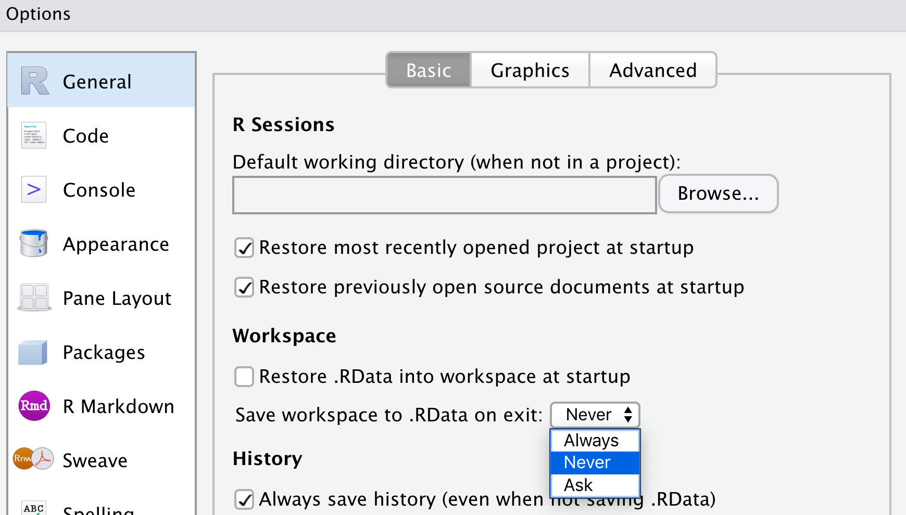
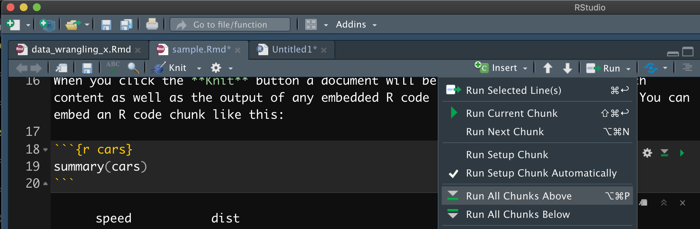
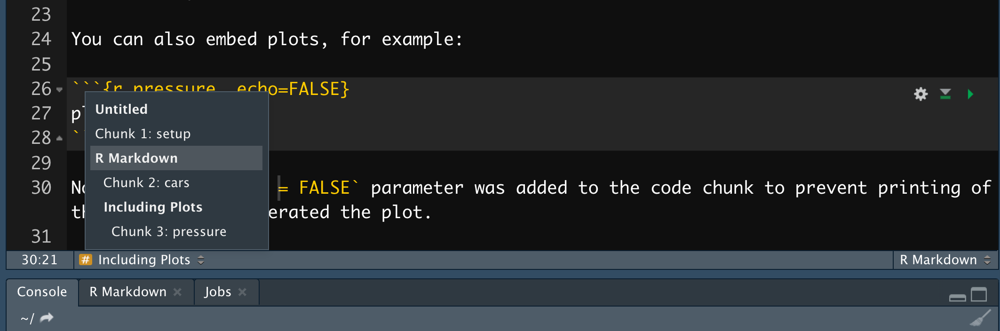
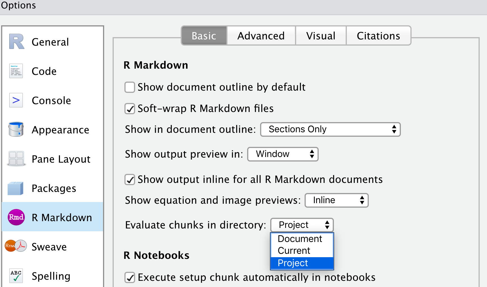
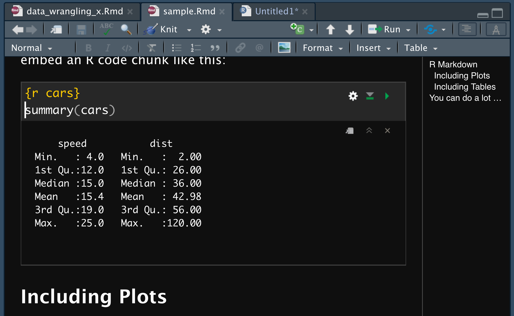

```{r, child = './../setup.Rmd'}
```

```{r, include = F}
#--- load packages ---#
suppressMessages(library(future.apply))
suppressMessages(library(parallel))
````

## Learning objectives

+ Learn how to organize your project: folder, codes, data files, etc
+ Learn how to organize R codes
+ Learn how to use various RStudio tips for efficient programming

## Table of contents

1. [RStudio Tips](#tips)
2. [How to organize your project and R codes](#organize)

<br>

<span style="color:red"> Tips: </span>hitting "o" key will give you a panel view of the slides

<!-- 
#/*=================================================*/
#' # RStudio tips
#/*=================================================*/
-->

---

class: inverse, center, middle
name: tips

# RStudio tips 

<html><div style='float:left'></div><hr color='#EB811B' size=1px width=1000px></html>

---

# R sessions and the global environment

.content-box-green[**Recommendation**]

Work on separate R sessions for different projects 
  * confusions between objects of the same or similar name (accidentally using the one you do not intend to use)
  * wasting memory by holding objects on the global environment that are completely irrelevant to your working project

--

.content-box-red[**Critical**]

+ As long as you have codes and datasets, all the results you have created in an R session can be reproduced. 

+ You have a process that takes very long? Then save its outcome and read just the outcome so you do not have to run the process all over again (caching).

--

.content-box-green[**Recommendation**]

+ Do not save your workspace when asked by RStudio because it is not necessary!
+ Indeed, let's turn off the options to save the workspace.

```{r  echo = F, out.width = "50%"}
 
```

---

# RStudio tips: code snippets

.content-box-green[**What is it?**]

Code snippets are functions that maps sequence of letters and symbols (short) to other sequence of letters and symbols (more complicated and long)

<br>

--

.content-box-green[**Syntax**]

```{r eval = F}
snippet (combination of letters to invoke)
  (what you want to print on R source pane) 
```

--

<br>

.content-box-green[**Example**]

+ piping operator

```{r eval = F}
snippet pi
  %>% 
```

Once you add this, you can type "pi" and hit `tab` (and hit `enter` if there are other competing shortcuts) to have `%>%` printed.

+ assignment operator

````markdown
snippet as
  <- 
````

Once you add this, you can type "as" and hit `tab` (and hit `enter` if there are other competing shortcuts) to have `<-` printed.

--

<br>

.content-box-green[**How to add snippets**]

+ Mac: Go to .blue[Preferences] $\rightarrow$ .blue[Code] $\rightarrow$ .blue[Edit Snippets], select R tab, and add snippets.
+ Windows: Go to .blue[Tools] $\rightarrow$ .blue[Global Options] $\rightarrow$ .blue[Code] $\rightarrow$ .blue[Edit Snippets], select R tab, and add snippets.

---

# Context-specificity  

.content-box-green[**Important**]

Suppose you are working on an Rmarkdown document.

+ You are in the R context if your cursor is in an R code chunk
+ You are in the Makrdown context if your cursor is outside of an R code chunk

Snippets defined in the R (Markdown) tab only works in the R (Markdown) context.

--

<br>

.content-box-green[**Try**]

+ open the "sample.Rmd" file
+ put your cursor anywhere .blue[outside] of the R code chunks
+ type "pi" and hit tab

--

<br>

.content-box-green[**Markdown code snippet example**]

This snippet will let you create an R code chunk with typing "rmc" and hit tab. Place it in the Markdown tab of the snippets list.

````markdown
snippet rmc
  `r ''````{r }
  ```
````

And, then hit `shift` + `tab` to insert the snippet.

+ `tab`: R context
+ `shift`+ `tab`: Markdown context

---

# Using variables in snippets

````markdown
snippet rmc
  `r ''````{r ${1:chunk_title}}
    ${2:chunk_content}
  ```
````

`$` is used as a special character to denote where the cursor should jump (by hitting `tab`) after completing each section of a snippet. 


---

# Code organization snippets: R

Define header snippets (modify them to your liking):

.content-box-green[**Level 1 header**]

```{r eval = F}
snippet rh1
  #===============================================
  # ${1:Level 1 header}
  #=============================================== 
```

.content-box-green[**Level 2 header**]

```{r eval = F}
snippet rh2
  #------------------------------
  ## ${1:Level 2 header}
  #------------------------------ 
```

.content-box-green[**Level 3 header**]

```{r eval = F}
snippet rh3
  #++++++++++++++++++++
  ### ${1:Level 3 header}
  #++++++++++++++++++++ 
```

---

# More potentially useful snippets 

+ add notes

````markdown
snippet note
  #--- ${1:note} ---# 
````

+ ggplot (scatter plot)

````markdown
snippet gl
  ggplot(data = ${1:dataset}) +
  geom_line(aes(y = ${2:y}, x = ${3:x}))
````

+ ggplot (density plot)

````markdown
snippet gd
  ggplot(data = ${1:dataset}) +
  geom_density(aes(x = ${2:x}))
````

---

# Code organization snippets: Markdown

Define header snippets (modify them to your liking):

.content-box-green[**Level 1 header**]

```{r eval = F}
snippet h1
  <!--===============================================-->
  # ${1:Level 1 header}
  <!--===============================================-->
```

.content-box-green[**Level 2 header**]

```{r eval = F}
snippet h2
  <!---------------------------------->
  ## ${1:Level 2 header}
  <!----------------------------------> 
```

.content-box-green[**Level 3 header**]

```{r eval = F}
snippet h3
  <!--++++++++++++++++++++-->
  ### ${1:Level 3 header}
  <!--++++++++++++++++++++--> 
```

<!-- 
#/*=================================================*/
#' # Organize your file system 
#/*=================================================*/
-->

---

class: inverse, center, middle
name: organize

# How to write and organize R codes 

<html><div style='float:left'></div><hr color='#EB811B' size=1px width=1000px></html>

---
class: middle 

# Before we start

.content-box-green[**Instruction**]

Go [here](https://www.dropbox.com/sh/w0ie7d7uuej3bpg/AADWey0xgxF2CQ7qXhC0lgw_a?dl=0) and download the sample project folder.


.content-box-green[**Note**]

No actual datasets are in the Data folder.


---

# Organizing your project

.left5[

.content-box-green[**Project Steps**]

A project mainly consists of four stages:

+ Step 1: collect data (most of the times, this is done outside of R)
+ Step 2: data wrangling to prepare the final datasets for analysis
+ Step 3: do analysis and produce results
+ Step 4: prepare documents (journal articles, reports, etc) based on the results

<br>

.content-box-green[**Project Folder Structure**]

+ **Code**: all the codes go in here
  * DataPrep: 
  * Analysis: 
+ **Data**
  * RawData: place the raw datasets here
  * ProcessedData: save the intermediate datasets here 
+ **Literature**: journal articles
+ **Results**: results (regression, figures, tables)
+ **Writing**: WORD, Latex files 


]

.right5[

.content-box-green[**Recommendations**]

+ Step 1:
  * place all the raw datasets (nothing else) in a designated folder inside the Data folder
  * do not ever override them, you only read them 
  * keep them intact
+ Step 2: 
  * write R codes to process (transform, merge, etc) the raw data and save all the R codes inside the Code/DataPrep folder 
  * save intermediate R objects or datasets in the Data/ProcessdData folder
  * do not mix codes and datasets in a single folder
+ Step 3:
  * write R codes to do analysis and produce results (regression table, figures, tables) and save them in the Results folder
  * save the R codes in the Code/Analysis folder
+ Step 4:
  * if you are using Rmd or Rnw (kintr + latex) to write a journal article or report, put them in the Writing folder
  * refer to figures and tables in the Results folder to insert into the document


]

---

# R code file names  

By naming R code files so that which steps they are for and in which order you should run them.

.content-box-green[**Examples**]

+ Step 1:
  * s1_01_download_weather_data.R
  * s1_02_download_political_boundary_data.R
+ Step 2:
  * s2_01_summarize_data.R
  * s2_02_merge_data.R
+ Step 3:
  * s3_01_regression_analysis.R
  * s3_02_gen_figures_tables.R


.content-box-green[**README.md**]

You can also add a README file that summarizes what each of the R code files can also help you remember what they do (take a look at the sample README file).


---

# R code file structure 

.left5[

.content-box-green[**Common Structure**]

All the R code files should have the following common structure:

+ Objective statement
  * state objectives
  * input: state input files and datasets
  * output: state output files and datasets
+ Setup
  * set the working directory
  * load packages
  * load functions
+ Actions
  * Action 1
  * Action 2
  * .
  * .
  * .
  * Action n

]

.right5[

.content-box-green[**Tips**]

Write R codes as if you are writing a report:

+ create sections and subsection based on the tasks   

+ use separators so it is easy to observe the transition between the sections and subsection (like user-defined headers we defined earlier)

+ make the name of the sections and subsections informative

+ annotate often (especially when there are quirks and irregularities that warrant attentions)

+ dynamically edit the "Objective statement" as you may change the objectives the R code file as you write R codes, which may involve changing what input files to use and what outputs you produce
]

 
---

# Rmarkdown as a compelling type of source file  

+ It is much easier to put regular texts in an Rmarkdown file than an R file (all the texts R code chunks are regular texts)

--

+ R crashed at a certain chunk and had to restart R and then run all the R codes up to the problematic chunk? 
  * This is not an issue in an R file because you can just select all the R codes above and run
  * This used to be a problem with an Rmarkdown file, having to run R code chunks one by one. But, now use `Run All Chunks Above` button (click on the triangle right to the `Run` button and select the option, or hit `option` + `command` + `P`).  

```{r  echo = F, out.width = "60%"}
 
```

--

+ Easily move between sections and subsection using the navigator at the bottom lower corner of the source pane

```{r  echo = F, out.width = "60%"}
 
```

---

# Rmarkdown as a source file: Tips


.content-box-green[**Tip 1**]

Make the project folder (the parent folder that includes all the folders including Data, Cocde folders, etc) an R project. 

Then, when you click the folder button on RStudio to open a source file, the pop up file system is automatically directed to the project folder (you do not need to find the project folder and then find the source file).  

--

.content-box-green[**Tip 2**]

After you designate the project folder as an R project, go to Preferences, choose the R Markdown tab, and then choose "Project" for the "Evaluate chunks in directory:" item.

```{r  echo = F, out.width = "50%"}
 
```

This will let you write a path to the dataset and files relative to the project folder. For example, 

```{r eval = F}
#--- read a data ---#
data <- readRDS("./Data/RawData/data.rds")   

#--- source an R source file ---#
source("./Code/data_preparation.R")   
``` 

---

# Visual mode for Rmarkdown


.content-box-red[**Preview version**]

Preview version (RStudio 1.4) has the visual mode for Rmarkdown

```{r  echo = F, out.width = "50%"}
 
```

It lets you 
+ edit Rmarkdown as it it is like you are editing in Word. 
+ navigate the file using the navigation bar at the right 

.content-box-green[**Installation**]

Install the preview version [here](https://rstudio.com/products/rstudio/download/preview/).

.content-box-green[**Caveat**]

Code snippets do not work in a Markdown context (should be fixed soon).


---

# R code style 

You can write R codes however you would like. But, your code may get more readable to you and others who might read your codes by following a style guideline that is accepted by many R users. There are several popular styles of formatting R codes:

+ [tidyverse style](https://style.tidyverse.org/)
+ [Google's R Style Guide](http://web.stanford.edu/class/cs109l/unrestricted/resources/google-style.html) 

.content-box-green[**Examples**]

Here are some examples of the `tidyverse` style:

+ [how to name objects](https://style.tidyverse.org/syntax.html#object-names)
+ [spacing](https://style.tidyverse.org/syntax.html#spacing)
+ [long lines](https://style.tidyverse.org/syntax.html#long-lines)
+ [piping](https://style.tidyverse.org/pipes.html#introduction)

.content-box-green[**Help**]

The `styler` package can help you follow partially the `tidyverse` coding style. 

Once the package is installed, you can highlight the lines of codes and hit `cmd` + `shift` + `A` foe Mac (`ctrl` + `shift` + `A` for Windows) to reformat the codes to conform with the tidyverse style.

Alternatively, you can click on  `Addins` in the middle of the menu at the top, and select `style selection`.


---
class: middle

# Resources 

+ [Efficient R Programming](https://csgillespie.github.io/efficientR/)
+ [tidyverse style guide](https://style.tidyverse.org/)
+ [`styler` github page](https://github.com/r-lib/styler)

