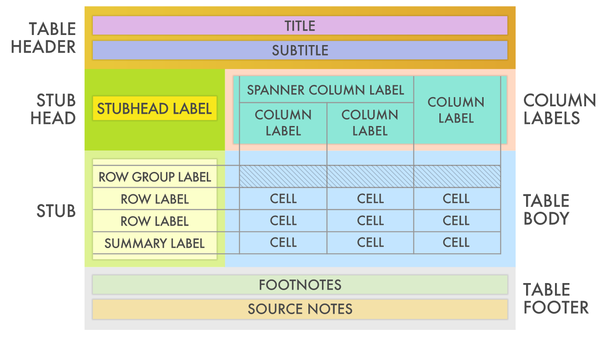

```{r, child = './../setup.Rmd'}
```

```{r, include = F, cache = F}
suppressMessages(library(nycflights13)) 
suppressMessages(library(gt)) 
suppressMessages(library(tidyverse)) 
```

# Before you start

## Learning objectives

The objectives of this chapter is to learn how to use the `gt` package to create publication-quality tables.

## Table of contents

1. [Create and modify tables: the basics](#create-modify)
2. [Formatting values in tables](#formating)
3. [Modify by column](#columns)
4. [Save tables as a file](#save)

<br>

<span style="color:red"> Tips: </span>hitting "o" key will give you a panel view of the slides


<!-- 
#=========================================
# gt Basics
#=========================================
-->

---

class: inverse, center, middle

# Create tables with the `gt` package 

<html><div style='float:left'></div><hr color='#EB811B' size=1px width=1000px></html>

---

```{r include = F}
# Define the start and end dates for the data range
start_date <- "2010-06-02"
end_date <- "2010-06-15"

# The HTML decimal references for the black
# up- and down-pointing triangles are: #9650 and #9660;
# use an in-line style to apply color
up_arrow <- "<span style=\"color:green\">&#9650;</span>"
down_arrow <- "<span style=\"color:red\">&#9660;</span>"

# Create a gt table based on a preprocessed `sp500`
sp500_data <- sp500 %>%
  dplyr::filter(date >= start_date & date <= end_date) %>%
  dplyr::select(-adj_close) 
```


```{r taste-gt, cache = F, include = F}
sp500_data %>% #BREAK
  gt() %>% #BREAK
  tab_header(
    title = "S&P 500"
  ) %>% #BREAK
  fmt_date(
    columns = vars(date),
    date_style = 7
  ) %>% #BREAK
  fmt_currency(
    columns = vars(open, high, low, close),
    currency = "USD"
  ) %>% #BREAK
  fmt_number(
    columns = vars(volume),
    scale_by = 1 / 1E9,
    pattern = "{x}B"
  ) %>% #BREAK
  text_transform(
    locations = cells_body(
      columns = "close",
      rows = close > open),
    fn = function(x) paste(x, up_arrow)
  ) %>% #BREAK
  text_transform(
    locations = cells_body(
      columns = "close",
      rows = close < open),
    fn = function(x) paste(x, down_arrow)
  ) %>% #BREAK
  cols_label(
    date = "Date", open = "Open", 
    high = "High", low = "Low", 
    close = "Close", volume = "Volume"
  )
```

`r chunk_reveal(
  chunk_name = "taste-gt", 
  title = "# Taste of the gt package",
  break_type = "user", 
  display_type = "both", 
  left_assign = FALSE,
  width = c(50, 50)
  )
`
  
<!-- 
#=========================================
# Create or Modify Parts  
#=========================================
-->
  
---

class: inverse, center, middle
name: create-modify

# Create table and modify Parts  

<html><div style='float:left'></div><hr color='#EB811B' size=1px width=1000px></html>

---


# Initiate a table 

.panelset[ 

.panel[.panel-name[Data Preparation]

.left4[
```{r results = "hide"}
#--- Define regions ---#
Australasia <- c("AU", "NZ")
Melanesia <- c("NC", "PG", "SB", "VU")
Polynesia <- c("PF", "WS", "TO", "TV")

#--- create a dataset ---#
tab_data <- countrypops %>%
  filter(country_code_2 %in% c(
    Australasia, Melanesia, Polynesia)
  ) %>%
  filter(year %in% c(1995, 2005, 2015)) %>%
  mutate(region = case_when(
    country_code_2 %in% Australasia ~ "Australasia",
    country_code_2 %in% Melanesia ~ "Melanesia",
    country_code_2 %in% Polynesia ~ "Polynesia",
  )) %>%
  pivot_wider(
    values_from = population, 
    names_from = year,
    names_prefix = "y_"
  ) %>%
  arrange(region, desc(y_2015)) %>%
  select(-starts_with("country_code")) %>% 
  mutate(
    pop_ratio_10_15 = y_2015/y_2005,
    date = "2013-11-14"
  )  

```
]

.right6[
```{r echo = F}
tab_data 
```
]

  ] 

  <!-- panel ends here -->
.panel[.panel-name[Instruction]

You can apply the `gt()` function to a `data.frame()` (or `tibble`) to create a basic table:

.left-code[
```{r default-table, eval = F}  
gt(tab_data)
```
]

.right-plot[
```{r default-table-f, ref.label = "default-table", echo = F}  

```
]

  ]
  <!-- panel ends here -->

.panel[.panel-name[Options]

.left-full[

Several useful options you might want to use when initiating a table with `gt()` are:

+ `rowname_col =`: specify which variable of the dataset becomes the row names 
+ `groupname_col =`: specify which variable of the dataset defines the groups each of the rows belong to  

We will see how they are used later in a demonstration.

]

  ] 

  <!-- panel ends here -->
]

<!-- panel set ends here -->


---


# Table structure and the name of its parts 

```{r out.width = "90%", echo = F}

```

source: <https://gt.rstudio.com/>

---

# Create or Modify Parts 

.panelset[ 


.panel[.panel-name[Modify parts]

.left-full[

From the most basic table you can generate by applying `gt()` function to create a table, you can add parts and modify the style using various functions:

+ `tab_header()`: add a table header
+ `tab_spanner()`: add a spanner column label
+ `tab_spanner_delim()`: create column labels and spanners via delimited names
+ `tab_row_group()`: add a row group to a `gt` table
+ `tab_stubhead()`: add label text to the stubhead
+ .orange[`tab_footnote()`]: add a table footnote
+ `tab_source_note()`: add a source note citation
+ `tab_style()`: add custom styles to one or more cells
+ `tab_options()`: modify the table output options

<br>

.red[Note]: Inside these functions, you specify the details of the **actions** and **locations** where you take actions (unless the locations of the actions are fixed like `tab_header()`).


]

  ]

<!-- panel ends here -->

.panel[.panel-name[Ex 1]

This adds the title and subtitle to the table at the top of the table (thus no need to specify the location.)

```{r eval = F}
tab_header(
  #--- actions ---#
  title = "A", 
  subtitle = "B"
)
```

.left5[

Before:

```{r echo = F}
tab_data %>% 
  select(-date, - pop_ratio_10_15, - region) %>% 
  .[1:5, ] %>% 
  gt() 
```

]

.right5[

After:

```{r echo = F}
tab_data %>% 
  select(-date, - pop_ratio_10_15, - region) %>% 
  .[1:5, ] %>% 
  gt() %>% 
  tab_header(title = "A", subtitle = "B")
```

]

  ] 

<!-- panel ends here -->

.panel[.panel-name[Ex 2]

This adds a footnote label to the right of the `y_2015` column label and put the footnote text `"This is a footnote"` at the bottom of the table.

```{r eval = F}
tab_footnote(
  #--- action ---#
  footnote = "This is a footnote", 
  #--- location ---#
  locations = cells_column_labels(columns = vars(y_2015))
  )
```

.left5[

Before:

```{r echo = F}
tab_data %>% 
  select(-date, - pop_ratio_10_15, - region) %>% 
  .[1:5, ] %>% 
  gt() 
```

]

.right5[

After:

```{r echo = F}
tab_data %>% 
  select(-date, - pop_ratio_10_15, - region) %>% 
  .[1:5, ] %>% 
  gt() %>% 
  tab_footnote(
    #--- action ---#
    footnote = "This is a footnote", 
    #--- location ---#
    locations = cells_column_labels(columns = vars(y_2015))
  )
```

]

  ] 

<!-- panel ends here -->

.panel[.panel-name[Locations]

.left-full[

In specifying the locations of the table you modify, you can use `cells_*()` functions. Some of those are (see the **Helper Functions** section of [here](https://gt.rstudio.com/reference/index.html) for the full list.):    

+ `cells_title()`: targets the table title or the table subtitle depending on the value given to the groups argument ("title" or "subtitle").
+ `cells_column_labels()`: targets the column labels.
+ `cells_row_groups()`: targets the row group labels in any available row groups using the groups argument.
+ `cells_stub()`: targets row labels in the table stub using the rows argument.
+ `cells_body()`: targets data cells in the table body using intersections of columns and rows.

Each of these functions have their own ways of specifying where exactly you want to target.

]

  ]

<!-- panel ends here -->

.panel[.panel-name[Locations examples]

<span style="color:blue"> Example 1: </span>

```{r }
locations = cells_column_labels(columns = vars(y_2015)) 
```

This will target the `y_2015` column label.

<span style="color:blue"> Example 2: </span>

```{r }
locations = cells_title(groups = "title")
```

This will target the title of the table.

<span style="color:blue"> Example 3: </span>

```{r }
locations = cells_body(
  columns = starts_with("y_"),
  rows = y_2015 > 100000  
)
```

This will target the cells of the table body (the cells that have values) that  

+ are in the columns whose labels start with `y_` (`y_1995`, `y_2005`, and `y_2015`) 
+ are in the rows where the value of the cells are greater than 100000

  ] 

<!-- panel ends here -->

.panel[.panel-name[columns and rows]

Here are the options you have for `columns = ` and `rows = ` in specifying the target locations.

.blue[`columns`]:

+ explicitly name the columns with `vars(variable name 1, variable 2, ...)`
+ use helper functions like `starts_with()`, `everything()`, etc (you saw these in the data wrangling lecture slides!)

.blue[`rows`]:

+ use logical evaluation expressions like `variable <= values` (e.g., `rows = pop_ratio_10_15 >= 1.2`)
+ use helper functions

  ] 

<!-- panel ends here -->


]

<!-- panel set ends here -->

---

```{r gt-create, cache = F, include = F}
gt_1 <- tab_data %>% #BREAK
  gt(
    rowname_col = "country_name",
    groupname_col = "region"
  ) %>% #BREAK
  tab_header(
    title = "Populations of Oceania's Countries in 1995, 2005, and 2015",
    subtitle = md("`exibble` is an R dataset")
  ) %>% #BREAK 
  tab_spanner(
    label = "2000s",
    columns = vars(y_2005, y_2015)
  ) %>% #BREAK
  tab_stubhead(
    label = "Country/Region"
  ) %>% #BREAK 
  tab_footnote(
    footnote = "This is the last year",
    locations = cells_column_labels(
      columns = vars(y_2015)
    )
  ) %>% #BREAK
  tab_source_note(
    source_note = md("From the `gt` package")
  )  
```

`r chunk_reveal(
  chunk_name = "gt-create", 
  title = "# Demonstrations 1: Create Parts",
  break_type = "user", 
  display_type = "both", 
  left_assign = TRUE,
  width = c(45, 55)
  )
`

---

# `tab_style()` and `tab_options()`

.panelset[ 

.panel[.panel-name[tab_style()]

.left-full[

You can use `tab_style()` to add custom styles to one or more cells. It consists of two parts:

+ `style` where you specify the style you would like to add  
+ `location` where you you specify where in the table you would like to apply the `style`  

<br>

.blue[Example]:

```{r eval = F}
tab_style(
  style = list(
    cell_fill(color = "lightcyan"),
    ),
  locations = cells_body(
    columns = vars(pop_ratio_10_15),
    rows = pop_ratio_10_15 >= 1.2 # this is like `dplyr::filter()`
  )
) 
```

This will work on the cells with their values greater than 1.2 (`rows = pop_ratio_10_15 >= 1.2`) in the `pop_ratio_10_15` column (`columns = vars(pop_ratio_10_15)`) to make the cell fill color `lightcyan` (`cell_fill(color = "lightcyan")`)

]

  ]

<!-- panel ends here -->

.panel[.panel-name[style()]

.left-full[

You use a series of `cell_*()` functions to direct your modification requests to specific parts of the **cells** in `style()`:

+ cell_fill()
+ cell_text()
+ cell_body()
+ cell_borders()

Inside these `cell_*()` functions, you specify what you want to do to the parts of the cells that you refer to with `cell_*()` functions. 

Some of the options are

+ `color`
+ `size`
+ `width`
+ `alpha`

To see the full list of options available, run `?cell_*()` to see their individual help pages.

]

  ] 

<!-- panel ends here -->

.panel[.panel-name[tab_options()]

.left-full[

You can control the style (theme) of a `gt` table using the `tab_options()` function. 

You can control virtually any part of a table with it (see [here](https://gt.rstudio.com/reference/tab_options.html) for the complete options you have).

Here is a few of the options:

+ `table.border.bottom.width`
+ `column_labels.vlines.width`
+ `row_group.border.left.color` 

You can easily feel how much control you have over the style of a table by just looking at these options...

.red[Note]: Unlike the other functions we have looked at, these options specify the actions (e.g., change `width`) and locations (e.g., `table.border.bottom`).

<br>

.blue[Example]:

```{r eval = F}
tab_options(
  footnotes.marks = letters, 
  heading.subtitle.font.size = px(20)
)
```

+ The first one changes the footnote marks to letters (e.g., "a", "b", ..) from numbers (e.g., 1, 2, ...) 
+ The second one changes the font size of the subtitle to 20 px. 

]

  ] 

  <!-- panel ends here -->

]

<!-- panel set ends here -->

---

```{r gt-tab-styles, cache = F, include = F}
gt_2 <- gt_1 %>% #BREAK 
  tab_style(
    style = list(
      cell_fill(color = "red")
      ),
    locations = cells_body(
      columns = vars(pop_ratio_10_15),
      rows = pop_ratio_10_15 >= 1.2 
    )
  ) %>% #BREAK
  tab_style(
    style = list(
      cell_borders(sides = "top", style =  "dotted"),
      cell_text(
        weight = "bold", 
        style = "italic", 
        color = "#E50000"
      )
    ),
    locations = cells_body(
      columns = vars(y_1995),
      rows = y_1995 < 300000 
    )
  ) %>% #BREAK
  tab_style(
    style = list(
      cell_text(
        size = px(10), 
        align = "right", 
        v_align = "top",
        decorate = "underline"
        )
      ),
    locations = cells_body(columns = vars(y_2005))
  ) 
```

`r chunk_reveal(
  chunk_name = "gt-tab-styles", 
  title = "# Demonstrations 2: tab_style()",
  break_type = "user", 
  display_type = "both", 
  left_assign = TRUE,
  width = c(45, 55)
  )
`


---

```{r tab-options, cache = F, include = F}
gt_3 <- gt_2 %>% 
  tab_options(
    table.background.color = "lightcyan", #BREAK2
    footnotes.marks = letters, #BREAK3
    data_row.padding = px(5), #BREAK4
    heading.subtitle.font.size = px(20), #BREAK5
    source_notes.border.bottom.color ="#B2B2FF", #BREAK6
    row_group.background.color = "#8B008B", #BREAK7
    table.border.bottom.width = px(5), #BREAK8
    table_body.border.top.color = "green" #BREAK9
  )

```

`r chunk_reveal(
  chunk_name = "tab-options", 
  title = "# Demonstrations 3: tab_options()",
  break_type = "non_seq", 
  display_type = "both", 
  left_assign = TRUE,
  width = c(45, 55)
  )
`

<!-- 
#=========================================
# Formatting
#=========================================
-->
  
---

class: inverse, center, middle
name: formating

# Formatting 

<html><div style='float:left'></div><hr color='#EB811B' size=1px width=1000px></html>

---

# Formatting 

.panelset[ 

.panel[.panel-name[Instruction]

.left-full[

Columns of data can be formatted with the `fmt_*()` functions. Here are some of those functions (see [here](https://gt.rstudio.com/reference/index.html) for the complete list). 

+ `fmt_number()`: Format numeric values
+ `fmt_percent()`: Format values as a percentage
+ `fmt_currency()`: Format values as currencies
+ `fmt_date()`: Format values as dates
+ `fmt_markdown()`: Format Markdown text
+ `fmt_missing()`: Format missing values
+ `text_transform()`: Perform targeted text transformation with a function

<br>

Using these function, you can do things like

+ change the the number of decimal points
+ add currency marks in front of numbers
+ parse markdown texts 
+ transform missing values (NA) to the text of your choice
 
]

  ]

<!-- panel ends here -->

.panel[.panel-name[How]

.left-full[

`fmt_*` functions work just like `tab_style`.

+ specify **actions** 
+ specify **locations** using `columns =` and `rows =`

**Example**

```{r eval = F}
fmt_currency(
  columns = vars(y_2005),
  currency = "USD"
) 
```

This will add `$` (action) in front of the numbers in the cells in `y_2005` column.

]

  ]

<!-- panel ends here -->

]

<!-- panel set ends here -->


---

```{r format, cache = F, include = F}
gt_4 <- gt_3 %>% #BREAK 
  fmt_number(
    columns = vars(y_1995, y_2005),
    decimals = 1,
    use_seps = TRUE
  ) %>% #BREAK
  fmt_percent(
    columns = vars(pop_ratio_10_15),
    row = y_1995 >= 300000,
    decimals = 1,
    use_seps = TRUE
  ) %>% #BREAK
  fmt_currency(
    columns = vars(y_2005),
    currency = "USD"
  ) %>% #BREAK
  fmt_date(
    columns = "date",
    date_style = 3
  )
```

`r chunk_reveal(
  chunk_name = "format", 
  title = "# Demonstrations: Formatting cell values",
  break_type = "user", 
  display_type = "both", 
  left_assign = TRUE,
  width = c(40, 60)
  )
`

<!-- 
#=========================================
# Modify Columns
#=========================================
-->
  
---

class: inverse, center, middle
name: columns

# Modify Columns 

<html><div style='float:left'></div><hr color='#EB811B' size=1px width=1000px></html>

---
  
# Modify Columns 
 
.panelset[ 

.panel[.panel-name[Instruction]

The cols_*() functions allow for modifications that act on entire columns, instead of working on particular target cells within columns using `tab_style()`.

Here are the list of `cols_*()` functions:

+ `cols_align()`: Set the alignment of columns
+ `cols_width()`: Set the widths of columns
+ `cols_label()`: Relabel one or more columns
+ `cols_move_to_start()`: Move one or more columns to the start
+ `cols_move_to_end()`: Move one or more columns to the end
+ `cols_move()`: Move one or more columns
+ `cols_hide()`: Hide one or more columns
+ `cols_merge_range()`: Merge two columns to a value range column
+ `cols_merge_uncert()`: Merge two columns to a value & uncertainty column
+ `cols_merge()`: Merge data from two or more columns to a single column

  ]

<!-- panel ends here -->

.panel[.panel-name[How]

some

  ]

<!-- panel ends here -->

]

<!-- panel set ends here -->

---


```{r columns-format, cache = F, include = F}
gt_5 <- gt_4 %>% #BREAK
  cols_align( # this is not reflected 
    align = "left", 
    columns = vars(y_1995)
  ) %>% #BREAK 
  cols_label(
    "y_1995" = 1995,
    "pop_ratio_10_15" = md("*Ratio*") 
  ) %>% #BREAK
  cols_move_to_start(
    columns = vars(pop_ratio_10_15, date)
  ) %>% #BREAK
  cols_move(
    columns = vars(y_2005),
    after = vars(date)
  ) %>% #BREAK
  cols_hide(
    columns = vars(date)
  ) %>% #BREAK
  cols_merge(
    columns = vars(y_1995, pop_ratio_10_15),
    hide_columns = vars(pop_ratio_10_15),
    pattern = "{1}/{2}"
  ) %>% #BREAK
  cols_width(
    vars(y_1995) ~ px(400)
  )
```

`r chunk_reveal(
  chunk_name = "columns-format", 
  title = "# Demonstrations: Modify column styles",
  break_type = "user", 
  display_type = "both", 
  left_assign = TRUE,
  width = c(40, 60)
  )
`

---


# Placing figures in table cells 

.panelset[ 

.panel[.panel-name[Instruction]

You can put figures in table cells instead of texts using `text_transform()` in conjunction with `*_image()` functions:

+ `web_image()`: Helper function for adding an image from the web
+ `local_image()`: Helper function for adding a local image
+ `ggplot_image()`: Helper function for adding a ggplot

Inside `text_transform()`, you 

+ specify the figure you add using one of the `*_image()` functions 
+ specify the location of the figure using `cells_*()` with `columns =` and `rows =` options 

  ]

<!-- panel ends here -->

.panel[.panel-name[How]

**Syntax**

```{r eval = F}
text_transform(
  locations = cells_*(),
  fn = function(x) {
    *_image()
  }
) 
```

**Example**

The following code will place `g_ex` (a ggplot object) of 50 px height in the cell located at [3, y_1995] of the table cell body.

```{r eval = F}
text_transform(
  locations = cells_body(
    columns = vars(y_1995), #<<
    rows = 3 #<<
  ),
  fn = function(x) {
    ggplot_image(g_ex, height = px(50)) #<<
  } 
)  
```

  ]

<!-- panel ends here -->

]

<!-- panel set ends here -->


---

```{r ggplot-added-flip, include = F}
gt_1 %>% #BREAK
  text_transform(
    locations = cells_body(
      columns = vars(y_1995),
      rows = 3
    ),
    fn = function(x) {
      ggplot_image(g_ex, height = px(50))
    }
  ) %>%  #BREAK 
  text_transform(
    locations = cells_body(
      columns = vars(y_1995),
      rows = 4
    ),
    fn = function(x) {
      local_image(
        filename = "gt_gg.png",
        height = px(50)
      )
    }
  )
```

`r chunk_reveal(
  chunk_name = "ggplot-added-flip", 
  title = "# Demonstration: Adding figures",
  break_type = "user", 
  display_type = "both", 
  left_assign = FALSE,
  width = c(50, 50)
  )
`

<!-- 
#=========================================
# Modify Columns
#=========================================
-->
  
---

class: inverse, center, middle
name: save

# Save tables 

<html><div style='float:left'></div><hr color='#EB811B' size=1px width=1000px></html>

---

# Save tables

.panelset[ 

.panel[.panel-name[Instruction]

Tables generated by `gt` can be saved as a file in various formats:

+ html
+ tex
+ lxt
+ pdf (uses the `webshot`package)
+ png
+ rtf

**Syntax**:
```{r eval = F}
gtsave(gt_tbl object, file name)  
```

**Example**:

```{r eval = F}
gtsave(gt_4, "gt4.tex") 
```

  ]

<!-- panel ends here -->

.panel[.panel-name[pdf]

By default, you have lots of white space around the table when saved as a pdf file. Run the following code to confirm this.

```{r eval = F}
gtsave(gt_4, "gt4_default.pdf") 
```

Use the `zoom` and `vwidth` options to control the white space and the size of the table:

```{r eval = F}
gtsave(gt_4, "gt4.pdf", zoom = 0.9, vwidth = 800) 
```

  ]

]

<!-- panel set ends here -->


