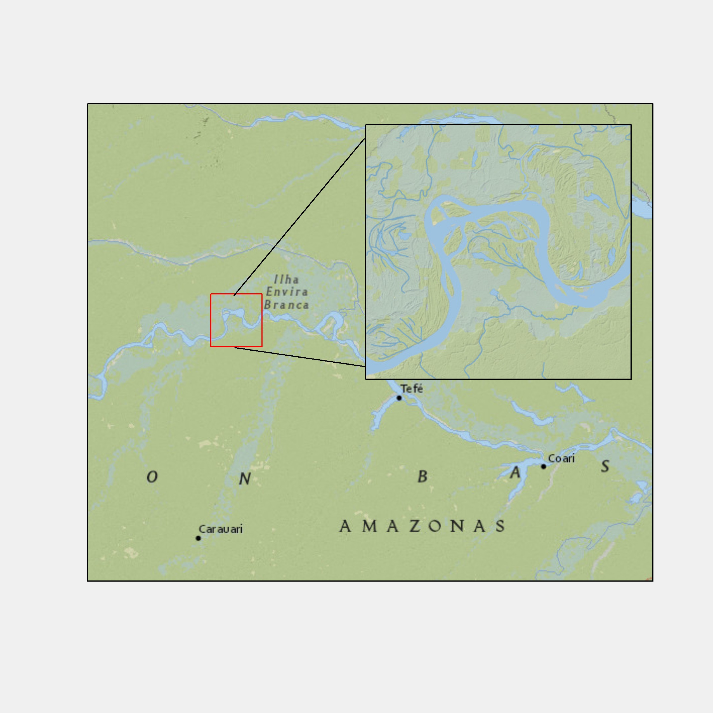

```{r, child = './../setup.Rmd'}
```

```{r echo = F, cache = F}
opts_knit$set(
  root.dir = "/Users/tmieno2/Dropbox/TeachingUNL/DataScience/LectureNotes/Chapter-8-SpatialData"
)
```

```{r eval = F}
setwd("/Users/tmieno2/Dropbox/TeachingUNL/DataScience/LectureNotes/Chapter-8-SpatialData")
```

```{r, include = F, cache = F}
suppressMessages(library(sf)) 
suppressMessages(library(patchwork))
suppressMessages(library(tigris))
suppressMessages(library(mapview))
suppressMessages(library(lubridate))
suppressMessages(library(tidyverse))
suppressMessages(library(exactextractr))
suppressMessages(library(raster))
suppressMessages(library(ggspatial))
suppressMessages(library(RStoolbox))
```

# Before you start

## Learning objectives

The objectives of this chapter is to learn how to create maps using the `ggplot2` package.

## Table of contents

1. [Creating maps from `sf` objects](#fig-vector)
2. [Raster data visualization using `geom_raster()`](#raster)
2. [Tips to make maps look professional ](#tips)

<br>

<span style="color:red"> Tips: </span>hitting letter "o" key will give you a panel view of the slides

---
class: middle

.content-box-green[**Prerequisites**]

+ What Geographic Coordinate System (GCS), Coordinate Reference System (CRS), and projection are ([this](https://annakrystalli.me/intro-r-gis/gis.html) is a good resource)

+ Distinctions between vector and raster data ([this](https://gis.stackexchange.com/questions/57142/what-is-the-difference-between-vector-and-raster-data-models) is a simple summary of the difference)

.content-box-green[**Datasets**]

+ Set the working directory to a directory

+ Create the "Data" folder under the directory you have set as the working directory 

+ Go [here](https://www.dropbox.com/sh/mn7yk7baru0pm4e/AADDfjIHcWpxACamPh3NVGI4a?dl=0), download all the files, and then save them in the "Data" folder you created in the step above

.content-box-green[**packages**]

```{r eval = F}
library(sf) 
library(patchwork)
library(tigris)
library(mapview)
library(lubridate)
library(tidyverse)
library(exactextractr)
library(raster)
```

---
class: middle

.content-box-green[**Mapping with ggplot2**]
 
+ Creating maps differs from creating non-spatial figures in some ways. However, the underlying principle and syntax under `ggplot2` to create maps and non-spatial figures are very similar. 

+ Indeed, you will find map making very intuitive and rather easy if you already have some knowledge of how ggplot2 works even if you have not created maps using ggplot2. The only major difference between them is the choice of geom_*() types.


.content-box-green[**geom_*()**] for mapping

We use two types of geom_*() for map creation:

+ geom_sf() for sf (vector) objects
+ geom_raster() for raster data

---
class: inverse, center, middle
name: fig-vector

# Crating maps from `sf` objects

<html><div style='float:left'></div><hr color='#EB811B' size=1px width=1000px></html>

---
class: middle

# Data Preparation

.panelset[ 

.panel[.panel-name[points]

```{r results = "hide"}
gw_KS_sf <- readRDS("./Data/gw_KS_sf.rds") 
```

.scroll-box-16[
```{r echo = F}
gw_KS_sf 
```
]
  ]

<!-- panel ends here -->

.panel[.panel-name[polygons]

```{r results = "hide"}
KS_county <- counties(state = "Kansas", cb = TRUE) %>% 
  st_as_sf() %>% 
  st_transform(st_crs(gw_KS_sf))
```

.scroll-box-16[
```{r echo = F}
KS_county 
```
]


  ]

<!-- panel ends here -->

.panel[.panel-name[lines]

```{r results = "hide"}
KS_railroads <- st_read(dsn = "./Data/", layer = "tl_2015_us_rails") %>% 
  st_crop(KS_county)
```

.scroll-box-16[
```{r echo = F}
KS_railroads 
```
]
  ] 

  <!-- panel ends here -->
]

<!-- panel set ends here -->

---
class: middle
 
# Basics

.content-box-green[**Instruction**]

+ We can use `geom_sf()` to create maps from `sf` objects

+ `geom_sf()` automatically detects the geometry type of spatial objects stored in an `sf` object and draw maps accordingly 

.content-box-green[**Syntax**]

```{r eval = F}
ggplot() +
  geom_sf(data = sf)
```

---
class: middle


.left4[
<br>
<br>
<br>
<br>
<br>
.content-box-green[**Example: Points**]
```{r points-ex, eval = F}  
(
g_wells <- ggplot(data = gw_KS_sf) +    
    geom_sf()
)
```
]

.right6[
```{r points-ex-f, ref.label = "points-ex", echo = F}  

```
]


---
class: middle


.left4[
<br>
<br>
<br>
<br>
<br>
.content-box-green[**Example: Polygons**]
```{r polygons-ex, eval = F}  
(
g_wells <- ggplot(data = KS_county) +    
    geom_sf()
)
```
]

.right6[
```{r polygons-ex-f, ref.label = "polygons-ex", echo = F}  

```
]


---
class: middle


.left4[
<br>
<br>
<br>
<br>
<br>
.content-box-green[**Example: Lines**]
```{r lines-ex, eval = F}  
(
g_wells <- ggplot(data = KS_railroads) +    
    geom_sf()
)
```
]

.right6[
```{r lines-ex-f, ref.label = "lines-ex", echo = F}  

```
]

---
class: middle

# Specifying aesthetics

+ Maps are just special kinds of figures and what you have learned directly applies here.   

+ Here, I will simply list examples to show just that

---

# Example: Points 

.panelset[ 

.panel[.panel-name[Instruction]


.content-box-green[**Aesthetics**]

+ `color`: color of the points
+ `fill`: available for some shapes (but likely useless)
+ `shape`: shape of the points
+ `size`: size of the points (rarely useful)

.content-box-green[**Dataset**]

For illustration here, let’s focus on the wells in one county so it is easy to detect the differences across various aesthetics configurations.

```{r }
gw_Stevens <- KS_county %>% 
  filter(NAME == "Stevens") %>% 
  st_crop(gw_KS_sf, .) 
```

  ]

<!-- panel ends here -->

.panel[.panel-name[Example 1]

.left4[
<br>
<br>
<br>
```{r ex-1, eval = F}  
ggplot() + 
  geom_sf(
    data = gw_Stevens,
    aes(color = af_used), 
    size = 2
  )
```

+ `color`: dependent on `af_used` (the amount of groundwater extraction)
+ `size`: constant across the points (bigger than default)

]

.right6[
```{r ex-1-f, ref.label = "ex-1", echo = F}  

```
]

  ]

<!-- panel ends here -->

.panel[.panel-name[Example 2]

.left4[
<br>
<br>
<br>
```{r ex-2, eval = F}  
ggplot() + 
  geom_sf(
    data = gw_Stevens,
    aes(size = af_used), 
    color = "blue", 
    shape = 15
  )
```


+ `color`: constant across the points (blue)
+ `size`: dependent on `af_used`
+ `shape`: constant across the points (square)

]

.right6[
```{r ex-2-f, ref.label = "ex-2", echo = F}  

```
]
  ] 

  <!-- panel ends here -->

.panel[.panel-name[Example 3]

.left4[
<br>
```{r ex-3, eval = F}  
gw_Stevens %>% 
  cbind(., st_coordinates(.)) %>% 
  mutate(
    east_west = ifelse(
      X < -101.3, 
      "west", 
      "east"
    )
  ) %>% 
  ggplot(data = .) +
    geom_sf(
      aes(
        shape = east_west, 
        color = east_west
      )
    )
```

+ `color`: dependent on whether located east of west of -101.3 in longitude
+ `shape`: dependent on whether located east of west of -101.3 in longitude

]

.right6[
```{r ex-3-f, ref.label = "ex-3", echo = F}  

```
]
  ] 

  <!-- panel ends here -->

]

<!-- panel set ends here -->

---
  
# Example: Polygons 

.panelset[ 

.panel[.panel-name[Instruction]

.content-box-green[**Aesthetics**]

+ `color`: color of the borders of the polygons
+ `fill`: color of the inside of the polygons
+ `shape`: not available
+ `size`: not available

  ]

<!-- panel ends here -->

.panel[.panel-name[Example 2]

.left4[
<br>
<br>
<br>
<br>
```{r ex-poly-1, eval = F}  
ggplot() +  
  geom_sf(
    data = KS_county,
    color = "red", 
    fill = "darkgreen"
  )
```

+ `color`: constant (red)
+ `fill`: constant (dark green)


]

.right6[
```{r ex-poly-1-f, ref.label = "ex-poly-1", echo = F}  

```
]

  ]

<!-- panel ends here -->

.panel[.panel-name[Example 2]

.left4[
<br>
<br>
<br>
<br>
```{r ex-poly-2, eval = F}  
KS_county_with_pumping <- gw_KS_sf %>%
  #--- only year == 2010 ---#
  filter(., year == 2010) %>%
  #--- get total pumping by county ---#
  aggregate(., KS_county, sum, na.rm = TRUE)

ggplot() +
  geom_sf(
    data = KS_county_with_pumping,
    aes(fill = af_used)
  )
```

+ `color`: default (black)
+ `fill`: dependent on the total amount of pumping in 2010

]

.right6[
```{r ex-poly-2-f, ref.label = "ex-poly-2", echo = F}  

```
]
  ] 

  <!-- panel ends here -->

]

<!-- panel set ends here -->

---

# Plotting multiple spatial objects in one figure 

.content-box-green[**How**]

You can combine all the layers created by `geom_sf()` additively so they appear in a single map:

.left4[

.content-box-green[**Example**]
<br>
<br>
<br>
```{r mult-ex, eval = F}  
ggplot() +  
  #--- this one uses KS_county ---#
  geom_sf(
    data = KS_county
  ) +
  #--- this one uses KS_railroads ---#
  geom_sf(
    data = KS_railroads, 
    color = "red"
  ) +
  #--- this one uses KS_wells ---#
  geom_sf(
    data = gw_KS_sf, 
    size = 0.1
  ) 

```
]

.right6[
```{r mult-ex-f, ref.label = "mult-ex", echo = F}  

```
]

---
class: middle

.content-box-green[**Note**]

+ The order of `geom_sf()`s matters. 

+ `geom_sf()`s that are added later are .red[superimposed] on top of the existing layers 

---
class: middle

.left4[
<br>
<br>
<br>
Here, wells are hidden beneath the county layer.

```{r mult-ex-order, eval = F}  
ggplot() +
  #--- this one uses KS_wells ---#
  geom_sf(
    data = gw_KS_sf, 
    size = 0.4
  )+  
  #--- this one uses KS_county ---#
  geom_sf(
    data = KS_county
  ) +
  #--- this one uses KS_railroads ---#
  geom_sf(
    data = KS_railroads, 
    color = "red"
  )  
```
]

.right6[
```{r mult-ex-order-f, ref.label = "mult-ex-order", echo = F}  

```
]

---
class: middle

# CRS

.content-box-green[**Note**]

`ggplot()` uses the CRS of the `sf` to draw a map by default. 


---
class: middle

.content-box-green[**Example: unprojected**]

.left4[

Currently, `KS_county` is unprojected.

```{r eval = F}
st_crs(KS_county)
```
.scroll-box-8[
```{r echo = F}
st_crs(KS_county)
```
]

Create a map:

```{r crs-gg, eval = F}  
(
g_county <- ggplot() +
  geom_sf(data = KS_county)
)
```

The map is drawn as if 1 degree in latitude and longitude are the same length. 

]

.right6[
```{r crs-gg-f, ref.label = "crs-gg", echo = F}  

```

]


---
class: middle

.content-box-green[**Example: projected**]

.left4[

Change the CRS and then create a map:

```{r crs-1, eval = F}  
g_32614 <- KS_county %>% 
  st_transform(32614) %>% #<<
  ggplot(data = .) +
    geom_sf()

#--- compare ---#
g_county/g_32614
```

+ Now, the map is drawn based on the new CRS of 32614 (the bottom figure)

+ Notice that the major grid lines are no longer straight in figure at the bottom unlike the one at the top 

+ X-Y labels are still in longitude and latitude (we will see how we change this)

]

.right6[
```{r crs-1-f, ref.label = "crs-1", echo = F}  

```
]
  
---
class: middle

.content-box-green[**Note**]

Alternatively, you could use `coord_sf()` to alter the CRS on the map, but not the CRS of the `sf` object itself.

.left4[

.content-box-green[**Example**]

```{r crs-2, eval = F}  
g_32614 <- ggplot() +
  geom_sf(data = KS_county) +
  coord_sf(crs = 32614) #<<

g_county/g_32614
```
]

.right6[
```{r crs-2-f, ref.label = "crs-2", echo = F}  

```
]

---
class: middle

.content-box-green[**Note**]

In order to have `X` and `Y` values in the same units as that of the CRS in use, you need to add `datum =` in `coord_sf()`.

.left4[

.content-box-green[**Example**]

```{r crs-3, eval = F}  
g_county <- ggplot() +
  geom_sf(data = KS_county)

g_32614 <- ggplot() +
  geom_sf(data = KS_county) +
  coord_sf(
    crs = 32614,
    datum = 32614
  ) 

g_county/g_32614
```
]

.right6[
```{r crs-3-f, ref.label = "crs-3", echo = F}  

```
]

---
class: middle

.content-box-green[**Note**]

When multiple `geom_sf()` layers, the CRS of the first layers is automatically applied for all the layers.

.left4[

.content-box-green[**Example**]
<br>
<br>
<br>
<br>
```{r crs-4, eval = F}  
ggplot() +  
  #--- epsg: 32614 ---#
  geom_sf(
    data = st_transform(
      KS_county, 
      32614
    )
  ) +
  #--- epsg: 4269 ---#
  geom_sf(
    data = KS_railroads
  )
```
]

.right6[
```{r crs-4-f, ref.label = "crs-4", echo = F}  

```
]

---
class: middle

.content-box-green[**Note**]

`coord_sf()` applies to all the layers.

.left4[

.content-box-green[**Example**]
<br>
<br>
<br>
```{r crs-csf-mult, eval = F}  
ggplot() +  
  #--- epsg: 4269 ---#
  geom_sf(
    data = KS_railroads
  ) +
  #--- epsg: 32614 ---#
  geom_sf(
    data = st_transform(
      KS_county, 
      32614
    ),
    fill = NA
  ) +
  #--- using 32614 ---#
  coord_sf(
    crs = 32614,
    datum = 32614
  )
```
]

.right6[
```{r crs-csf-mult-f, ref.label = "crs-csf-mult", echo = F}  

```
]

---
class: inverse, center, middle
name: raster

# Raster data visualization using `geom_raster()`

<html><div style='float:left'></div><hr color='#EB811B' size=1px width=1000px></html>

---
class: middle


.content-box-green[**How**]

Visualizing `Raster*` objects involves two steps:

1.convert raster dataset into a `data.frame` with coordinates

2. use `geom_raster()` to make a map

.content-box-green[**Raster Dataset**]

```{r }
tmax_Jan_09_rs <- stack("./Data/tmax_Jan_09.tif")  
```

---
class: middle

.content-box-green[**1st step**]

In order to create maps from the information stored in `Raster*` objects, you first convert them to a regular data.frame using `as.data.frame()`.

.content-box-green[**Demonstration**]

.left5[
```{r }
tmax_Jan_09_df <- tmax_Jan_09_rs %>% 
  #--- convert Raster* to a data.frame with XY ---#
  as.data.frame(xy = TRUE) %>% 
  #--- remove cells with NA for any of the layers ---#
  na.omit() %>% 
  #--- change the variable names ---#
  setnames(
    paste0("tmax_Jan_09.", 1:5), 
    seq(
      ymd("2009-01-01"), 
      ymd("2009-01-05"), 
      by = "days"
    ) %>% 
    as.character()
  ) 
```
]

.right5[
```{r }
head(tmax_Jan_09_df) 
```

Notice that the data is in a wide format where tmax values for different dates are stored as separate columns. 
]

---
class: middle

.content-box-green[**Step 2**]

+ Once the conversion is done, you can use `geom_raster()` to create a map. 

+ Unlike `geom_sf()`, you need to supply the variables names for the geographical coordinates (here x for longitude and y for latitude). 

+ You also need to specify which variable to use for fill color differentiation.


.left4[

.content-box-green[**Demonstration**]
<br>
```{r fig-raster, eval = F}  
ggplot() +
  geom_raster(
    data = tmax_Jan_09_df,
    aes(
      x = x, 
      y = y, 
      fill = `2009-01-01`
    )
  ) +
  scale_fill_viridis_c() +
  theme_void() +
  theme(
    legend.position = "bottom"
  )
```
]

.right6[
```{r fig-raster-f, ref.label = "fig-raster", echo = F, out.width = "80%"}  

```
]

---
class: middle


.content-box-green[**Note**]

To create a faceted (faceted by date) figure, you first make `tmax_Jan_09_df` long and then use `facet_wrap()` or `facet_grid()`.

.left4[

<br>
<br>

.content-box-green[**Demonstration**]

```{r faceted-demo, eval = F}  
#--- wide to long ---#
tmax_long_df <- tmax_Jan_09_df %>%
pivot_longer(
  c(-x, -y),
  names_to = "date",
  values_to = "tmax"
)

#--- faceted figure ---#
ggplot() +
  geom_raster(
    data = tmax_long_df, 
    aes(x = x, y = y, fill = tmax)
  ) +
  facet_wrap(date ~ .) +
  coord_equal() +
  scale_fill_viridis_c() +
  theme_void() +
  theme(
    legend.position = "bottom"
  )
```
]

.right6[
```{r faceted-demo-f, ref.label = "faceted-demo", echo = F}  

```
]

---
class: middle

# In conjunction with `geom_sf()` 

You can easily add `geom_sf()` layers to a map created with `geom_raster()` additively. 

.content-box-green[**Caveat**]

+ The `sf` objects and the `Raster*` objects .red[must] have the same CRS.

+ No automatic CRS conversions occur unlike the case where you only use `geom_sf()`.

---
class: middle

.content-box-green[**Data Preparation**]

Let’s crop the tmax data to Kansas and create a map of tmax values displayed on top of the Kansas county borders.

```{r }
#--- KS to have the same CRS ---#
KS_county_sp <- st_transform(KS_county, projection(tmax_Jan_09_rs))

#--- crop to KS ---#
KS_tmax_Jan_09 <- crop(tmax_Jan_09_rs, KS_county_sp) 

#--- convert to a df ---#
KS_tmax_Jan_09_df <- as.data.frame(
  KS_tmax_Jan_09,
  xy = TRUE
) %>% 
na.omit() %>%
pivot_longer(
  c(-x, -y),
  names_to = "date",
  values_to = "tmax"
)
```

---
class: middle

.left4[

<br>
<br>
<br>

.content-box-green[**Demonstration**]

```{r raster-sf, eval = F}  
ggplot() +
  geom_raster(
    data = KS_tmax_Jan_09_df, 
    aes(x = x, y = y, fill = tmax)
  ) +
  geom_sf(
    data = KS_county, 
    fill = NA
  ) +
  facet_wrap(date ~ .) +
  scale_fill_viridis_c() +
  theme_void() +
  theme(
    legend.position = "bottom"
  )
```
]

.right6[
```{r raster-sf-f, ref.label = "raster-sf", echo = F}  

```
]

---
class: middle

.content-box-green[**Note**]

This is what happens when the `sf` and `Raster*` objects are on different CRS.

.left4[

.content-box-green[**Demonstration**]

```{r raster-sf-wrong, eval = F}  
ggplot() +
  geom_raster(
    data = KS_tmax_Jan_09_df, 
    aes(x = x, y = y, fill = tmax)
  ) +
  geom_sf(
    data = st_transform(KS_county, 32614), 
    fill = NA
  ) +
  facet_wrap(date ~ .) +
  scale_fill_viridis_c() +
  theme_void() +
  theme(
    legend.position = "bottom"
  )
```
]

.right6[
```{r raster-sf-wrong-f, ref.label = "raster-sf-wrong", echo = F}  

```
]

---
class: inverse, center, middle
name: tips

# Tips to make maps look professional 

<html><div style='float:left'></div><hr color='#EB811B' size=1px width=1000px></html>

---
class: middle

# Theme

+ `theme_void()` is an appealing pre-made theme that can get rid of many unnecessary components from default maps.

+ look at the lecture slides on theme for details. 

.left5[
```{r }
g_county 
```
]

.right5[
```{r }
g_county + theme_void()
```
]

---
class: middle

# North arrow and scale bar

The `ggspatial` package lets you put a north arrow and scale bar on a map using `annotation_scale()` and `annotation_north_arrow()`

```{r eval = F}
library(ggspatial)  
```

---
class: middle

.content-box-green[**preparation**]

```{r results = "hide"}
g_nc <- st_read(system.file("shape/nc.shp", package="sf")) %>% 
  ggplot(data = .) + 
    geom_sf() + 
    theme_void()
```

---
class: middle


.left4[

.content-box-green[**scale bar**]

Use `annotation_scale()` to add a scale bar.

.content-box-green[**Example**]

```{r scale, eval = F}  
g_nc + 
  annotation_scale(
    location = "bl", 
    width_hint = 0.2
  )
```

+ `location`: determines where the scale bar is
  * first letter is either `t` (top) or `b` (bottom)
  * second letter is either `l` (left) or `r` (right).  
+ `width_hint`: determines the length of the scale bar relative to the plot

]

.right6[
```{r scale-f, ref.label = "scale", echo = F}  

```
]

---
class: middle


.left4[

.content-box-green[**fine-tune the location**]

Use `pad_x` and `pad_y` options to fine-tune the location of the scale bar.

.content-box-green[**Example**]

```{r scale-pad, eval = F}  
g_nc + 
  annotation_scale(
    location = "bl", 
    width_hint = 0.2,
    pad_x = unit(1, "in"),
    pad_y = unit(0.3, "in")
  )
```

A positive number means that the scale bar will be placed further away from closest border of the plot.

+ `pad_x`: since the second letter of `location` is `l`, the scale bar move an inch from the left border of the map

+ `pad_y`: since the first letter of `location` is `b`, the scale bar move 0.3 inches from the bottom border of the map

]

.right6[
```{r scale-pad-f, ref.label = "scale-pad", echo = F}  

```
]

---
class: middle

.left4[

.content-box-green[**north arrow**]

+ Use `annotation_north_arrow()` to add north arrow
+ It works just like `annotation_scale()`

.content-box-green[**Example**]

```{r scale-pad-na, eval = F}  
g_nc + 
  annotation_scale(
    location = "bl", 
    width_hint = 0.2,
    pad_x = unit(1, "in"),
    pad_y = unit(0.3, "in")
  ) +
  #--- add north arrow ---#
  annotation_north_arrow(
    location = "tl", 
    pad_x = unit(0.2, "in"), 
    pad_y = unit(-0.1, "in"),
    style = north_arrow_fancy_orienteering
   ) 
```

+ use `style` option to pick a different type of north arrow symbol

]

.right6[
```{r scale-pad-na-f, ref.label = "scale-pad-na", echo = F}  

```
]

---
class: middle

# Inset maps

.content-box-green[**What is it?**]

Maps in a map

.content-box-green[**Motivation**]

Inset maps provide a better sense of the geographic extent and the location of the area of interest relative to the larger geographic extent that the readers are more familiar with. 

.content-box-green[**Example**]

```{r  echo = F, out.width = "40%"}
 
```

---
class: middle

.content-box-green[**Data for demonstration**]

Consider three counties in Kansas: Cheyenne, Sherman, and Wallace. 

```{r }
three_counties <- filter(KS_county, NAME %in% c("Cheyenne", "Sherman", "Wallace"))
```

---
class: middle

.left5[

Here is the map of three counties:

```{r ks-three, eval = F}  
(
g_three_counties <- ggplot() +
  geom_sf(
    data = three_counties
  ) +
  geom_sf_text(
    data = three_counties, 
    aes(label = NAME)
  ) +
  theme_void()
)
```

For those who are not familiar with Kansas, it might be useful to show where in Kansas they are located on the same map (or even where Kansas is in the U.S.). 
]

.right5[
```{r ks-three-f, ref.label = "ks-three", echo = F}  

```
]

---
class: middle

.content-box-green[**How**]
    
We can create an inset map using `ggplotGrob()` and `annotation_custom()`.

Here are the steps:

1. create a map of the area of interest and turn it into a `grob` object using `ggplotGrob()`

2. create a map of the region that includes the area of interest and turn it into a `grob` object using `ggplotGrob()`

3. combine the two using `annotation_custom()`


---
class: middle

.content-box-green[**Step 1**]

Create a map of the area of interest and turn it into a `grob` object using `ggplotGrob()`


```{r }
#--- convert the ggplot into a grob ---#
# g_three_counties was made two slides back
grob_aoi <- ggplotGrob(g_three_counties)

#--- check the class ---#
class(grob_aoi)
```

---
class: middle

.content-box-green[**Step 2**]

Create a map of the region that includes the area of interest and turn it into a `grob` object using `ggplotGrob()`

```{r }
#--- create a map of Kansas ---#
g_region <- ggplot() +
  geom_sf(data = KS_county) +
  geom_sf(data = three_counties, fill = "blue", color = "red", alpha = 0.5) +
  theme_void()

#--- convert to a grob ---#
grob_region <- ggplotGrob(g_region)
```

---
class: middle

.content-box-green[**Step 3**]

Combine the two using `annotation_custom()`   

<html><div style='float:left'></div><hr color='#EB811B' size=1px width=1000px></html>

.left5[

The first task is to initiate a `ggplot` with `coord_equal()` as follows:

```{r combine, eval = F}  
(
g_inset <- ggplot() +
  coord_equal(
    xlim = c(0, 1), 
    ylim = c(0, 1), 
    expand = FALSE
  )
)
```

You now have a blank canvas to put the images on.
]

.right5[
```{r combine-f, ref.label = "combine", echo = F}  

```

]

---
class: middle

.content-box-green[**Step 3**]

Combine the two using `annotation_custom()`   

<html><div style='float:left'></div><hr color='#EB811B' size=1px width=1000px></html>

.left5[

Let's add a layer to the canvas with `annotation_custom()` in which you provide the `grob` object (a map) and specify the range of the canvas the map occupies.

```{r combine-2, eval = F}  
g_inset +
  annotation_custom(
    grob_aoi, 
    xmin = 0, 
    xmax = 0.8, 
    ymin = 0,
    ymax = 1
  )
```
]

.right5[
```{r combine-2-f, ref.label = "combine-2", echo = F}  

```

]

---
class: middle

.content-box-green[**Step 3**]

Combine the two using `annotation_custom()`   

<html><div style='float:left'></div><hr color='#EB811B' size=1px width=1000px></html>

.left5[

Similarly, we can add `grob_region` using `annotation_custom()`. Let's put it at the right lower corner of the map.

```{r combine-3, eval = F}  
g_inset +
  annotation_custom(
    grob_aoi, # area of interest
    xmin = 0, 
    xmax = 0.8, 
    ymin = 0,
    ymax = 1
  ) +
  annotation_custom(
    grob_region, 
    xmin = 0.6, 
    xmax = 1, 
    ymin = 0,
    ymax = 0.3
  )
```
]

.right5[
```{r combine-3-f, ref.label = "combine-3", echo = F}  

```

]

---
class: middle

.content-box-green[**Step 3**]

Combine the two using `annotation_custom()`   

<html><div style='float:left'></div><hr color='#EB811B' size=1px width=1000px></html>

.left5[

Note that the resulting map still has the default theme because it does not inherit the theme of maps added by `annotation_custom()`. So, you can add `theme_void()` to the map to make the border disappear.

```{r combine-4, eval = F}  
g_inset +
  annotation_custom(
    grob_aoi, # area of interest
    xmin = 0, 
    xmax = 0.8, 
    ymin = 0,
    ymax = 1
  ) +
  annotation_custom(
    grob_region, 
    xmin = 0.6, 
    xmax = 1, 
    ymin = 0,
    ymax = 0.3
  ) +
  theme_void() #<<
```
]

.right5[
```{r combine-4-f, ref.label = "combine-4", echo = F}  

```

]

---
class: middle

# Too many cells  


.content-box-green[**Problem**]

R struggles to create a map from a raster layer that has many many cells. 

.content-box-green[**Solution**]

In such cases, you can aggregate multiple cells into a single cell so that the spatial resolution of the raster data becomes lower using the `raster::aggregate()` function. 

---
class: middle

.content-box-green[**Syntax**]

```{r eval = F}
raster::aggregate(Raster* object, fact = a number)  
```

+ `fact`: aggregation factor expressed as number of cells in each direction (horizontally and vertically).  

+ For each of the new (aggregated) cells, the values of the original cells are averaged (mean). 

---
class: middle

.content-box-green[**Raw Data**]
  
```{r read-ndre}
(
ndre_080319_rl <- raster("./Data/Preston_2019_Rate_Blocks_3-AUG-2019_ndre_raw.tif")
)
```

.content-box-green[**aggregate**]

```{r aggregate-raster}
(
ndre_080319_rl_ag <- raster::aggregate(ndre_080319_rl, fact = 10)  
)
```

The aggregated raster layer has about 1/100 th of cells compared to the raw data.

---
class: middle

.content-box-green[**Visualization**]

.left4[
```{r raster-ag-fig, eval = F}  
ndre_080319_rl_ag %>% 
  as.data.frame(xy = TRUE) %>% 
  setnames(names(.)[3], "value") %>% 
  ggplot(data = .) +
    geom_raster(
      aes(
        x = x,
        y = y,
        fill = value
      )
    )
```
]

.right6[
```{r raster-ag-fig-f, ref.label = "raster-ag-fig", echo = F}  

```
]

---
class: middle

# Create a map from three RGB layers  

Suppose you have three raster layers for R (red), G (green), and B (blue).  

You can use `ggRGB()` from the `RStoolbox` package to create a map with actual colors based on the three color composite layers. 

```{r eval = F}
library(RStoolbox)  
```

.content-box-green[**Data**]

```{r get-three-layers, eval = F}
blue <- raster("./Data/Annos_062718_RE_transparent_reflectance_blue.tif") %>% 
  aggregate(10)

red <- raster("./Data/Annos_062718_RE_transparent_reflectance_red.tif") %>% 
  aggregate(10)

green <- raster("./Data/Annos_062718_RE_transparent_reflectance_green.tif") %>% 
  aggregate(10)
```

```{r echo = F}
blue <- readRDS("./Data/blue.rds")
red <- readRDS("./Data/red.rds")
green <- readRDS("./Data/green.rds")
```

.content-box-green[**How**]

+ stack the three layers in the order of B, G, R (not a requirement, but makes things easier later)

+ use `ggRGB()` to create a map

---
class: middle

.left4[
```{r rgb-map, eval = F}  
#--- stack ---#
rgb_rs <- stack(blue, green, red)

#--- create a map ---#
ggRGB(rgb_rs, 
  stretch = "sqrt", 
  limits = matrix(
    c(0, 0.0, 0, 0.25, 0.25, 0.25), 
    ncol = 2
  )
) +
theme_void()
```

```{r echo = F, eval = F}
# library(tmap)
# tm_shape(rgb_rs) +  
#   tm_rgb(r = 3, g = 2, b =1)
```
]

.right6[
```{r rgb-map-f, ref.label = "rgb-map", echo = F}  

```
]


---
class: middle

# Faceted and `patchwork`ed maps  

There are two ways of creating a panel of maps:

+ `facet_grid()`: create multiple panels of maps at one time from a single dataset
+ `patchwork`: create individual maps and patch them together later

While the `facet_grid()` approach will have a single color bar shared by the maps, the `patchwork` approach clearly allows for individual color bars for the maps. 

---
class: middle


.content-box-green[**Goal**]

Create a map of NDRE at three different dates

.content-box-green[**Datesets**]

```{r eval = F, echo = T}
ndre_080319 <- raster("./Data/Preston_2019_Rate_Blocks_3-AUG-2019_ndre_raw.tif") %>% 
  aggregate(10) %>% 
  as.data.frame(xy = TRUE) %>% 
  setnames(names(.)[3], "value") %>% 
  mutate(date = as.Date("2019-08-03"))

ndre_081319 <- raster("./Data/Preston_2019_Rate_Blocks_13-AUG-2019_ndre_raw.tif") %>% 
  aggregate(10) %>% 
  as.data.frame(xy = TRUE) %>% 
  setnames(names(.)[3], "value") %>% 
  mutate(date = as.Date("2019-08-13"))

ndre_072019 <- raster("./Data/Preston_2019_Rate_Blocks_20-JUL-2019_ndre_raw.tif") %>% 
  aggregate(10) %>% 
  as.data.frame(xy = TRUE) %>% 
  setnames(names(.)[3], "value") %>% 
  mutate(date = as.Date("2019-07-20"))

#--- combine all the datasets ---#
ndre_all <- rbind(ndre_080319, ndre_081319, ndre_072019)
```

```{r echo = F}
# saveRDS(ndre_080319, "ndre_080319.rds") 
# saveRDS(ndre_081319, "ndre_081319.rds") 
# saveRDS(ndre_072019, "ndre_072019.rds") 

ndre_080319 <- readRDS("ndre_080319.rds") 
ndre_081319 <- readRDS("ndre_081319.rds") 
ndre_072019 <- readRDS("ndre_072019.rds") 

ndre_all <- rbind(ndre_080319, ndre_081319, ndre_072019)
```

---
class: middle


.left4[

<br>
<br>
<br>
<br>

.content-box-green[**faceted (shared scale bar)**]

```{r faceted, eval = F}  
ggplot() +
  geom_raster(
    data = ndre_all, 
    aes(x = x, y = y, fill = value)
  ) +
  facet_wrap(date ~ .) +
  coord_equal() +
  scale_fill_viridis_c() +
  theme_void()
```
]

.right6[
```{r faceted-f, ref.label = "faceted", echo = F}  

```
]


---
class: middle

.content-box-green[**patchwork (independent scale bar)**]

.left4[
```{r patched, eval = F}  
g_ndre_080319 <- ggplot() +
  geom_raster(
    data = ndre_080319, 
    aes(x = x, y = y, fill = value)
  ) +
  coord_equal() +
  scale_fill_viridis_c() +
  theme_void()

g_ndre_081319 <- ggplot() +
  geom_raster(
    data = ndre_081319, 
    aes(x = x, y = y, fill = value)
  ) +
  coord_equal() +
  scale_fill_viridis_c() +
  theme_void()

g_ndre_072019 <- ggplot() +
  geom_raster(
    data = ndre_072019, 
    aes(x = x, y = y, fill = value)
  ) +
  coord_equal() +
  scale_fill_viridis_c() +
  theme_void()

g_ndre_072019 | g_ndre_080319 | g_ndre_081319 
```
]

.right6[
```{r patched-f, ref.label = "patched", echo = F}  

```
]


