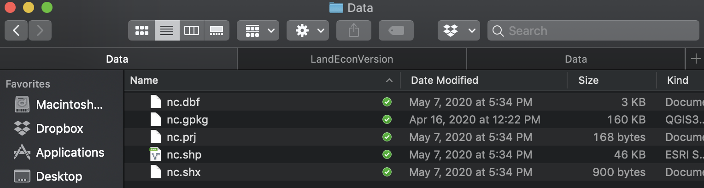

```{r, child = './../setup.Rmd'}
```

```{r, include = F, cache = F}
suppressMessages(library(sf)) 
suppressMessages(library(patchwork))
suppressMessages(library(mapview))
suppressMessages(library(tidyverse))
```

```{r eval = F}
setwd("~/Dropbox/TeachingUNL/DataScience/LectureNotes/Chapter-8-SpatialData")
```

# Before you start

## Learning objectives

The objectives of this chapter is to learn how to use R as GIS, specifically how to handle vector spatial data.

## Table of contents

1. [Understanding the data structure of `sf`](#data-structure)
2. [Create sf objects yourself](#create-sf)
3. [Different Types of Simple Feature Geometry (`sfg`)](#dif-sfg)
4. [Constructing `sfc` and `sf` from `sfg`](#const)
5. [Importing and exporting spatial datasets](#input-output)
6. [Projection](#proj)
7. [Quick and Interactive View of an `sf` Object](#view)
8. [Conversion to and from `sp` objects](#sf-to-sp)
9. [Non-spatial Transformation of `sf`](#non-trans)
10. [Non-interactive geometrical operations](#non-int-geo)

<br>

<span style="color:red"> Tips: </span>hitting letter "o" key will give you a panel view of the slides

---
class: middle

#  Prerequisites and Preparation

.content-box-green[**Prerequisites**]

+ What Geographic Coordinate System (GCS), Coordinate Reference System (CRS), and projection are ([this](https://annakrystalli.me/intro-r-gis/gis.html) is a good resource)

+ Distinctions between vector and raster data ([this](https://gis.stackexchange.com/questions/57142/what-is-the-difference-between-vector-and-raster-data-models) is a simple summary of the difference)

.content-box-green[**Preparation**]

+ Set the working directory to a directory

+ Create the "Data" folder under the directory you have set as the working directory 

+ Go [here](https://www.dropbox.com/sh/mn7yk7baru0pm4e/AADDfjIHcWpxACamPh3NVGI4a?dl=0), download all the files, and then save them in the "Data" folder you created in the step above

---
class: inverse, center, middle
name: data-structure

# Vector data with the `sf` package

<html><div style='float:left'></div><hr color='#EB811B' size=1px width=1000px></html>

---
class: middle

# Introduction

+ The `sf` package provides a simply way of storing geographic information and the attributes of the geographic units in a single dataset called simple feature (`sf`).

+ The `sf` package allows you to do almost all the spatial operations you would need for your research
	* Projection
	* Read/write to spatial datasets in various formats (including shape files)
	* Non-interactive geometrical operations
		- create buffers
		- calculate area 
		- calculate distance 
	* Interactive geometrical operations
		- spatially subset datasets
		- extracting values from the intersecting spatial objects
	

---
class: middle

# Preparation 

Read the North Carolina county boundary data: 

```{r results = "hide"}
nc <- st_read(system.file("shape/nc.shp", package="sf")) %>% 
	dplyr::select(AREA, NAME, FIPS)
```

Check the class:

```{r }
class(nc)	
```

---
class: middle

# Data structure of `sf`  

.left5[

```{r }
nc  
```

]

.right5[

+ The first line tells you this is an simple feature (`sf`) object with 100 features and 3 attributes (fields)

+ So, an `sf` object looks just like a `data.frame` where rows representing observation units, columns representing attributes, except for a special column named `geometry` 

+ The `geometry` column stores the geographic information of the observation units (here, county)

.content-box-green[**Example**]

Ashe County (1st row) has area of 0.114, FIPS code of 37009, and so on. And the entry in geometry column at the first row represents the geographic information of Ashe County.  

]


---
class: middle


# The `geometry` column 

.left5[

```{r }
dplyr::select(nc, geometry)  
```

]

.right5[

+ An entry of the `geometry` columns is an simple feature geometry (`sfg`).

+ In general, `sfg` represents the geographic information of a single geometric feature (here, county).

+ There are different types of `sfg`s (POINT, LINESTRING, POLYGON, MULTIPOLYGON, etc)

+ In this example, all the `sfg`s are of type `MULTIPOLYGON`

+ A collection of multiple `sfg`s as a column is called simple feature geometry column (`sfc`), which can make a `geometry` column in an `sf` object

]

---
class: middle

# Simple Feature Geometry (`sfg`) 

.left5[

Let's see what an `sfg` is made of.

```{r }
st_geometry(nc[1, ])[[1]][[1]][[1]] %>% head(10)
```
]

.right5[

+ Each row represents a point 
	* 1st column: longitude
	* 2nd column: latitude

+ Points are stored in a matrix form

+ Connecting all the points forms a polygon

]


---
class: inverse, center, middle
name: dif-sfg

# Different Types of Simple Feature Geometry (`sfg`) 

<html><div style='float:left'></div><hr color='#EB811B' size=1px width=1000px></html>

---
class:middle 

Some of the moist common types of spatial objects represented by `sfg` are the following:

+ `POINT`: area-less feature that represents a point (e.g., well, city, farmland) 

+ `LINESTRING`: (e.g., a tributary of a river) 

+ `MULTILINESTRING`: (e.g., river with more than one tributary) 

+ `POLYGON`: geometry with a positive area (e.g., county, state, country)

+ `MULTIPOLYGON`: collection of polygons to represent a single object (e.g., countries with islands: U.S., Japan, etc)

---
class: middle

.panelset[ 

<!-- panel ends here -->

.panel[.panel-name[POINT]

`POINT` is the simplest geometry type and is represented by a vector of two numeric values. An example below shows how a `POINT` feature can be made from scratch:

```{r sf_point}
#--- create a POINT ---#
a_point <- st_point(c(2,1))
```

The `st_point()` function creates a `POINT` object when supplied with a vector of two numeric values. If you check the class of the newly created object,

```{r class}
#--- check the class of the object ---#
class(a_point)
```

you can see that it's indeed a `POINT` object. But, it's also an `sfg` object. So, `a_point` is an `sfg` object of type `POINT`. 

	]

<!-- panel ends here -->

.panel[.panel-name[LINESTRING]

.left5[

A `LINESTRING` objects are represented by a sequence of points in a matrix:  

```{r linestrting}
#--- collection of points in a matrix form ---#
(
s1 <- rbind(c(2,3),c(3,4),c(3,5),c(1,5))
)
```

You can turn the matrix into a LINESTRING using `st_linestring()`:

```{r }
#--- create a "LINESTRING" ---#
a_linestring <- st_linestring(s1)

#--- check the class ---#
class(a_linestring)
```
]

.right5[

```{r plot_line, out.width = "80%"}
plot(a_linestring)
```

As you can see, each pair of consecutive points in the matrix are connected by a straight line to form a line. 

]

	]

<!-- panel ends here -->

.panel[.panel-name[POLYGON]

.left6[

+ Just like the `LINESTRING` object we created earlier, a `POLYGON` is represented by a collection of points. 
+ However, the first and last points in the matrix have to be the same to form a polygon 

```{r polygon_1, highlight.output = c(2, 7)}
(p1 <- rbind(c(0,0), c(3,0), c(3,2), c(2,5), c(1,3), c(0,0)))
```

You can turn the matrix into a POLYGON using `st_polygon()`, which takes a matrix in a `list()` :

```{r }
a_polygon <- st_polygon(list(p1))

class(a_polygon)
```
]

.right4[

```{r out.width = "80%"}
plot(a_polygon, col = "red")
```

]

	] 

<!-- panel ends here -->

.panel[.panel-name[POLYGON with holes]

.left5[
+ A `POLYGON` can have holes in it.

+ The first matrix of a list becomes the exterior ring, and all the subsequent matrices will be holes within the exterior ring.  

```{r polygon_hole}
#--- a hole within p1 ---#
p2 <- rbind(c(1,1), c(1,2), c(2,2), c(1,1))

#--- create a polygon with hole ---#
a_plygon_with_a_hole <- st_polygon(list(p1,p2))
```

]

.right5[
```{r }
#--- see what it looks like ---#
plot(a_plygon_with_a_hole, col = "red")
```
]

	] 

<!-- panel ends here -->

.panel[.panel-name[MULTIPOLYGON]

.left5[

To create a `MULTIPOLYGON` object you create a list of lists of matrices, with each inner list representing a polygon.  

```{r multi_polygon}
#--- create a matrix for another polygon ---#
p3 <- rbind(c(4,0), c(5,0), c(5,3), c(4,2), c(4,0)) 
```

You supply a list of lists of matrices to the `st_multipolygon()` function to make a `MULTIPOLYGON` object.

```{r }
a_multipolygon <- st_multipolygon(
	list(
		list(p1,p2), # the polygon with a hole
		list(p3) # the new polygon created above
	)
)
```

Each of `list(p1,p2)` and `list(p3)` represents a polygon.

]

.right5[
```{r }
plot(a_multipolygon, col = "red")
```
]


	] 

<!-- panel ends here -->
]

<!-- panel set ends here -->

---
class: middle

# Exercises

.content-box-green[**Exercise 1**]
Create an `sfg` of `POINT`. 

.content-box-green[**Exercise 2**]
Create an `sfg` of `POLYGON`. 

---
class: inverse, center, middle
name: const

# Constructing `sfc` and `sf` from `sfg`

<html><div style='float:left'></div><hr color='#EB811B' size=1px width=1000px></html>

---
class:middle 

# Constructing `sfc` from `sfg`s

`sfg` is an object class that represents a single spatial object.

--

We can combine multiple `sfg`s as a list to create a simple feature geometry list-column (`sfc`).

--

To make a simple feature geometry list-column (`sfc`), you can simply supply a list of `sfg` to the `st_sfc()` function as follows:

```{r gen_sfc}
#--- create an sfc ---#
sfc_ex <- st_sfc(
	list(
		a_point,
		a_linestring,
		a_polygon,
		a_multipolygon
	)
)
```

--

Check its class:

```{r }
class(sfc_ex)
```

---
class: middle

# Constructing an `sf` using an `sfc`

To create an `sf` object, you first add an `sfc` as a column to a `data.frame`.  

```{r add_sfc_to_df}
#--- create a data.frame ---#
df_ex <- data.frame(
  name=c('A','B','C','D')
)

#--- add the sfc as a column ---#
df_ex$geometry <- sfc_ex 

#--- take a look ---#
df_ex
```

At this point, it is not yet recognized as an `sf` by R yet.

```{r class_check}
#--- see what it looks like (this is not an sf object yet) ---#
class(df_ex)
```

---
class: middle

You can register it as an `sf` object using `st_as_sf()`.

```{r gen_sf_yourself}
#--- let R recognize the data frame as sf ---#
sf_ex <- st_as_sf(df_ex)

#--- see what it looks like ---#
sf_ex
```

As you can see `sf_ex` is now recognized also as an `sf` object.  

```{r check_if_sf}
#--- check the class ---#
class(sf_ex)
```

---
class: middle

# Exercises 1

.content-box-green[**Exercise 1.1**]

Create an `sfc` using the `POINT` and `POLYGON` you made earlier.

.content-box-green[**Exercise 1.2**]

Create an `sf` object using the `sfc` object you created above, where the additional variable in the `sf` object is `id` with the `POINT` and `POLYGON` assigned `id = 1` and `id = 2`, respectively. 
 

---
class: inverse, center, middle
name: input-output

# Reading and writing vector data

<html><div style='float:left'></div><hr color='#EB811B' size=1px width=1000px></html>

---
class: middle

# Instruction
 
+ The vast majority of people still use ArcGIS software to handle spatial data, which has its own system of storing spatial data called .blue[shapefile] system. 

--

+ shapefile is a collection of files including 
	* shp: stores geometry information (like `sfg` and `sfc`) 
	* prj: projection information 

```{r  echo = F, out.width = "70%"}
 
```

--

+ chances are that your collaborators use shapefiles.

+ There are many GIS data online that are available only as shapefiles. 

--

+ So, it is important to learn how to read and write shapefiles 

---
class: middle

# Importing shape files

We can use `st_read()` to read a shapefile. It reads in a shapefile and then turn the data into an sf object. 

--

.content-box-green[**Syntax**]

```{r eval = F}
st_read(dsn = path to the shp files, layer = prefix to the files) 
```

+ `dsn`: the path to folder in which the shape files you want to import are stored.

+ `layer`: the prefix of the files 

--

.content-box-green[**Example**]

```{r import_nc_shp, results = "hide"}
nc_loaded <- st_read(dsn = "./Data", "nc") 
```

Notice that you do not add `.shp` extension to the file name: `nc`, not `nc.shp`

---
class: middle

# Exporting to shape files

You can use the `st_write()` function to write an `sf` object to shape files. 

--

.content-box-green[**Syntax**]

```{r write_nc, eval = FALSE}
st_write(sf object, dsn = folder path, layer = layer name, driver = "ESRI Shapefile", append = FALSE)
```

+ Use `driver = "ESRI Shapefile"`: to write the `sf` as shape files
+ `append = FALSE` forces writing the data when the shape files with the same name already exists 

--

.content-box-green[**Example**]

```{r write_nc_error, error = TRUE}
st_write(nc_loaded, dsn="./Data", layer = "nc2", driver="ESRI Shapefile")
```

This code will export an `sf` object called `nc_loaded` as `nc2.shp` (along with other supporting files) in the "Data" folder relative to the working directory. 

---
class: middle

# Alternative spatial data file formats 

.content-box-green[**Why not shape files?**]

+ If your collaborator is using ArcGIS and demanding that he/she needs a shapefile for his/her work, sure you can use the above command to write a shapefile. 

+ But, there is really no need to work with the shapefile system. It is a myth that spatial datasets have to be stored as shape files.

+ Basically, we are using the file system just because ArcGIS is the pioneer of GIS software and many people are still using it not because it is the best format available to store spatial objects.

+ Indeed, there are some limitations to shape files (see [here](https://carto.com/blog/fgdb-gpkg/))

+ But, first and foremost, it is annoying to have many files for a single spatial object 

---
class: middle

# Geopackage 

One of the alternative data formats that is considered superior to the shapefile system is [GeoPackage](https://www.geopackage.org/), which overcomes various limitations associated with shapefile. 

+ Unlike the shapefile system, it produces only a single file with .gpkg extension.
+ GeoPackage files can also be read into ArcGIS. 

--

.content-box-green[**Write**]

To write an `sf` object to a geopackage file, you simply give the file path to the `dsn` option (note that you do not use the `layer` option unlike the shape files case).

```{r gpkg, eval = FALSE}
#--- write as a gpkg file ---#
st_write(nc, dsn = "./Data/nc.gpkg", append = FALSE)
```

--

.content-box-green[**Read**]

You can use the `st_read()` function to read a geopacakge file like below:

```{r eval = F}
#--- read a gpkg file ---#
nc <- st_read("./Data/nc.gpkg")
```

---
class: middle

# R data set (rds) 

Or better yet, if your collaborator uses R (or if it is only you who is going to use the data), then just save an `sf` object as an rds file using `saveRDS()`, which can be of course read using `readRDS()`.

--

.content-box-green[**Write**]

```{r save_read_nc_as_rds, eval = F}
#--- save as an rds ---#
saveRDS(nc, ".Data/nc_county.rds")
```	

--

.content-box-green[**Read**]

```{r eval = F}
#--- read an rds ---#
nc <- readRDS(".Data/nc_county.rds")
```

--

.content-box-green[**Note**]

The use of rds files can be particularly attractive when the dataset is large because rds files are typically more memory efficient than shape files. 

---
class: middle

# Exercises 2

.content-box-green[**Exercise 2.1**]

Read the "Fairway_Five" shape files onto R using `st_read()`, and name it `Fairway_Five`.

```{r include = F}
Fairway_Five <- st_read(dsn = "./Data", "Fairway_Five") 
```

.content-box-green[**Exercise 2.2**]

Write the "Fairway_Five" as a Geopackage file using `st_write()`.

```{r eval = F, echo = F}
st_write(Fairway_Five, "./Data/Fairway_Five.gpkg", overwrite = TRUE) 
```

---
class: inverse, center, middle
name: proj

# Projection

<html><div style='float:left'></div><hr color='#EB811B' size=1px width=1000px></html>

---
class: middle

# Motivation

You often need to reproject an `sf` using a different coordinate reference system (CRS) because you need it to have the same CRS as an `sf` object that you are interacting it with (spatial join) or mapping it with. 

---
class: middle

# Checking the current CRS

.left5[

In order to check the current CRS for an `sf` object, you can use the `st_crs()` function. 

```{r , highlight.output = c(3, 17)}
st_crs(nc)	
```

]

.right5[

+ `sf` uses the **Well Known Text** format to store the coordinate reference system (CRS), which is one of many many formats to store CRS information (See [here](https://spatialreference.org/ref/epsg/nad27/))

+ `ID["EPSG", 4267]` means that the EPSG code for this CRS is 4267
	* EPSG code is a CRS reference system developed by by European Petroleum Survey Group (EPSG) 
	* You can find the CRS-EPSG number correspondence [here](http://spatialreference.org/ref/epsg/). 

+ When you transform an `sf` using a different CRS, you can use its EPSG number if the CRS has an EPSG number
	* Potential pool of CRS is infinite. 
	* Only the commonly-used CRS have been assigned EPSG SRID. 

]

---
class: middle

# Project or re-project `sf` objects

You can use `st_transform()` to apply a different projection method to an `sf` object.

--

.content-box-green[**Syntax**]

```{r eval = F}
st_transform(sf, EPSG number/CRS in WTK)
```

--

.content-box-green[**Example**]

Let's transform (reproject) the data using `NAD83 / UTM zone 14N` CRS. Its EPSG number is `26914`.

```{r }
nc_utm <- st_transform(nc, 26914)
```

---
class: middle

# Confirm the change in CRS

.scroll-box-24[
```{r highlight.output = 4}
st_crs(nc_utm)
```
]

---
class: middle

# Compare the CRS of `nc` and `nc_utm`

.left5[
```{r }
dplyr::select(nc, geometry)
```	
]

.right5[
```{r }
dplyr::select(nc_utm, geometry)
```
]

---
class: middle

# Projection using the CRS of another `sf`  

+ You often need to change the CRS of an `sf` object when you interact (e.g., spatial subsetting, joining, etc) it with another `sf` object. 

+ In such a case, you can extract the CRS of the other `sf` object using `st_crs()` and use it for transformation.

+ So, you do not need to find the EPSG of the CRS of the `sf` object you are interacting it with.

---
class: middle

.content-box-green[**Example**]

```{r to_utm17, echo = F}
#--- transform ---#
nc_utm_back_to_original <- st_transform(
	nc_utm, 
	st_crs(nc)
)
```

```{r to_utm17-run, eval = F}
#--- transform ---#
nc_utm_back_to_original <- st_transform(
	nc_utm, 
	`st_crs(nc)`
)
```

--

.content-box-green[**Cornfirm**]

.scroll-box-16[
```{r highlight.output = 4}
st_crs(nc_utm_back_to_original)
```
]

---
class: middle

# Exercises 3 

.content-box-green[**Exercise 3.1**]

Check the CRS of `Fairway_Five`.

.content-box-green[**Exercise 3.2**]

Find the EPSG code for WGS 84, and change the CRS of `Fairway_Five` to WGS 84 using the EPSG code.

---
class: inverse, center, middle
name: view

# Quick and Interactive View of an `sf` Object

<html><div style='float:left'></div><hr color='#EB811B' size=1px width=1000px></html>

---
class: middle

# Quick view using `plot()`

.left5[
The easiest way to visualize an `sf` object is to use `plot()`:

```{r quick-plot, fig.cap = "Quick Visualization of an sf object", out.width = "70%"}
plot(nc) 
```

]

.right5[

+ `plot()` create a map for each variable where the spatial units are color-differentiated based on the values of the variable

+  We will learn how to create more elaborate maps that are of publication-quality using the `ggplot2` package later

]

---
class: middle

# Quick interactive view using `mapView()`

.left-full[

.content-box-green[**Motivation**]

Sometimes it is useful to be able to tell where certain spatial objects are and what values are associated with them on a map. 

.content-box-green[**Instruction**]

The `mapView()` function from the `mapview` package can create an interactive map where you can point to a spatial object and the associated information is revealed on the map.

.content-box-green[**Syntax**]

```{r eval = F}
mapView(sf object)	
```

]


---
class: middle

.content-box-green[**Example**]

Let's use the North Carolina county map as an example here:

```{r interactove-nc-run, echo = F, cache = F}
#--- generate an interactive map ---#
mapView(nc)  
```

---
class: middle

# Quick interactive view using the `tmap` package

.left-full[

Alternatively, you could use the `tmap` package to create interactive maps. 

.content-box-green[**Instruction**]

You can first create a static map following a syntax like this:

```{r syntax-tmap, eval = F}
#--- NOT RUN (for polygons) ---#
tm_shape(sf) +
  tm_polygons() 

#--- NOT RUN (for points) ---#
tm_shape(sf) +
  tm_symbols() 
```

Then, you can apply `tmap_leaflet()` to the static map to have an interactive view of the map.
 ] 

---
class: middle

.content-box-green[**Example**]
 
Create a static map of `nc` county boundaries:

```{r statics-map}
tm_nc_polygons <- tm_shape(nc) + tm_polygons() 
```

Apply `tmap_leaflet()` to `tm_nc_polygons` to have this

```{r tmap-nc}
tmap_leaflet(tm_nc_polygons)
```

---
class: inverse, center, middle
name: df-to-sf

# Turning a data.frame of points into an `sf` 

<html><div style='float:left'></div><hr color='#EB811B' size=1px width=1000px></html>

---
class: middle

.content-box-green[**Motivation**]

.left-full[

+ Often times, you have a dataset with geographic coordinates as variables in a csv or other formats
 
+ It would not be recognized as a spatial dataset by R immediately when it is read into R. 

+ In this case, you need to identify which variables represent the geographic coordinates from the data set, and create an `sf` yourself. 

+ Fortunately, it is easy to do so using the `st_as_sf()` function.

]	
 

---
class: middle

.content-box-green[**Preparation**]

Let's read a dataset (irrigation wells in Nebraska):

```{r data_read_as_dataframe}
#--- read irrigation well registration data ---#
(
wells <- readRDS('./Data/well_registration.rds')  %>% 
	dplyr::select(wellid, ownerid, acres, longdd, latdd)
)
``` 

---
class: middle

```{r echo = F}
wells
```

In this dataset, `longdd` and `latdd` represent longitude and latitude, respectively.

We also know (yes, YOU need to know the CRS of your data) that the geographic coordinates system of this data is NAD 83 $(epsg=4269)$ for this dataset. 

--

As you can see the data is not an `sf` object.  
```{r }
class(wells)
```

---
class: middle

We now turn the dataset into an `sf` object using `st_as_sf()`.

.content-box-green[**Syntax**]

```{r eval = F}
st_as_sf(
	data.frame, 
	coords = c(
		longitude var, 
		latitude var
	),
	crs = crs
)	
```

--

.content-box-green[**Example**]

```{r dataframe_to_sf}
#--- recognize it as an sf ---#
wells_sf <- st_as_sf(
	wells, 
	coords = c(
		"longdd",
		"latdd"
	),
	crs = 4269
)
```

---
class: middle

.content-box-green[**Take a look**]

```{r highlight.output = 5}
head(wells_sf[1:5,])
```

---
class: middle

# Exercises 4

.content-box-green[**Exercise 4.1**]

Read "MAP0233.csv" using `read_csv()` from the `readr` package and name it `mower_sensor`.

```{r include = F}
mower_sensor <- read_csv("./Data/MAP0233.csv")
```

.content-box-green[**Exercise 4.2**]

Using the `LAT` (latitude) and `LNG` (longitude) columns, turn the tibble into an `sf`, and then assign the CRS of WGS 84 using its EPSG code.  

```{r include = F}
mower_sensor_sf <- mower_sensor %>% 
	st_as_sf(
	coords = c(
		"LNG", 
		"LAT"
	)
)
```

---
class: inverse, center, middle
name: sf-to-sp

# Conversion to and from `sp` objects

<html><div style='float:left'></div><hr color='#EB811B' size=1px width=1000px></html>

---
class: middle

.content-box-green[**Motivation**]

+ The `sp` package is the predecessor of the `sf` package (developed by the same person)

+ There are many packages that only accept spatial objects defined by the `sp` package
	* `spdep`: spatial econometrics
	* `GWmodel`: runs geographically-weighted regression

+ In that case, it is good to know how to convert an `sf` object to an `sp` object, vice versa. 

---
class: middle

.content-box-green[**Instruction**]

+ You can convert an `sf` object to its `sp` counterpart using by `as(sf_object, "Spatial")`.
+ You can convert an `sp` object to its `sf` counterpart using by `st_as_sf(sp_object)`.

---
class: middle

.content-box-green[**sf to sp**]

```{r as_spatial}
wells_sp <- as(wells_sf, "Spatial")

class(wells_sp)
```

--

.content-box-green[**sp to sf**]

```{r back_to_sf}
wells_sf <- st_as_sf(wells_sp)

class(wells_sf)
```

---
class: inverse, center, middle
name: non-trans

# Non-spatial Transformation of `sf`

<html><div style='float:left'></div><hr color='#EB811B' size=1px width=1000px></html>

---
class: middle

.content-box-green[**Note**]
		
.left-full[

+ An important feature of an `sf` object is that it is basically a `data.frame` with geometric information stored as a variable (column). 

+ This means that transforming an `sf` object works just like transforming a `data.frame`. 

+ Basically, everything you can do to a `data.frame`, you can do to an `sf` as well.

+ `dplyr` verbs work well with `sf`

]

---
class: middle

.content-box-green[**dplyr::select**]

```{r apply_dplyr}
#--- here is what the data looks like ---#
dplyr::select(wells_sf, wellid)
```

Notice that `geometry` column will be retained after `dplyr::select()` even if you did not tell R to keep it above.

---
class: middle

.content-box-green[**select, filter, mutate**]

Let's apply `dplyr::select()`, `dplyr::filter()`, and `dplyr::mutate()` to the dataset.

```{r dplyr_transformation, eval = F}
#--- do some transformations ---#
wells_sf %>% 
  #--- select variables (geometry will always remain after select) ---#
  dplyr::select(wellid, acres) %>% 
  #--- removes observations with acre < 30  ---#
  dplyr::filter(acres > 30) %>% 
  #--- hectare instead of acre ---#
  dplyr::mutate(hectare = acres * 0.404686) 
```

.scroll-box-12[

```{r dplyr-transformation-run, echo = F}
#--- do some transformations ---#
wells_sf %>% 
  #--- select variables (geometry will always remain after select) ---#
  dplyr::select(wellid, acres) %>% 
  #--- removes observations with acre < 30  ---#
  dplyr::filter(acres > 30) %>% 
  #--- hectare instead of acre ---#
  dplyr::mutate(hectare = acres * 0.404686) 
```

]

+ As you can see, you can use `dplyr` verbs to  `sf` objects.
+ This is not the case for the spatial objects defined by the `sp` package (the predecessor of the `sf` package)

---
class: inverse, center, middle
name: non-int-geo

# Non-interactive geometrical operations 

<html><div style='float:left'></div><hr color='#EB811B' size=1px width=1000px></html>

---
class: middle

# Create buffers

You can use `st_buffer()` to create buffers of the specified length around points, lines, and polygons.

---
class: middle

.content-box-green[**Syntax**]

```{r eval = F}
st_buffer(sf object, dist = distance)
```

+ `dist`: provide the distance in the unit of the CRS 

--

.content-box-green[**Example**]

```{r , warning = T}
nc_buffer <- st_buffer(nc[1, ], dist = 0.2)
```

+ You get this warning because you should not be calculating euclidean distance using longitude and latitude.

+ Make sure you project first, and then apply `st_buffer()`.

---
class: middle

.content-box-green[**Visualization**]

```{r out.width = "50%"}
ggplot() +
	geom_sf(data = nc_buffer, fill = "blue", alpha = 0.2)	+
	geom_sf(data = nc[1, ])	
```

---
class: middle 

# Find the area of polygons 

You can use `st_area()` to calculate the area of all the polygons in an `sf` object.

---
class: middle

.content-box-green[**Example**]

```{r }
(
nc <- mutate(nc, area = st_area(nc)) %>% 
	dplyr::select(area)
)
```

---
class: middle

.content-box-green[**Caveat**]

By default, area calculated by `st_area()`

```{r }
class(nc$area)
```

--

So, you need to convert it to numeric like this:

```{r eval = F}
nc <- mutate(nc, 
	area = st_area(nc) `%>% as.numeric()`,
	) %>% 
	dplyr::select(area)
```

```{r echo = F}
nc <- mutate(nc, 
	area = st_area(nc) %>% as.numeric(),
	) %>% 
	dplyr::select(area)
```

```{r }
class(nc$area)
```

---
class: middle

# Find the centroid of polygons

You can use `st_centroid()` to find the centroid of each of all the polygons in an `sf` object.

---
class: middle

.content-box-green[**Example**]

```{r }
st_centroid(nc)	
```

As you can see, `st_centroid()` returns an `sf` of centroids as points.

---
class: middle

.content-box-green[**Matrix of coordinates**]

If you want longitude (X) and latitude (Y) of the centroids, you can further apply `st_coordinates()`.

```{r }
st_centroid(nc) %>% st_coordinates() %>% head()
```

--

Of course, you can easily add the XY matrix to the original `sf` file using `cbind()`:

```{r }
cbind(nc, st_centroid(nc) %>% st_coordinates()) %>% head()
```

---
class: middle

# Calculate the distance between points

You can use `st_distance()` to calculate the distance between points.


.content-box-green[**Syntax 1**]

```{r eval = F}
st_distance(sf) 
```

This finds the distance between the points in `sf`.

.content-box-green[**Syntax 2**]

```{r eval = F}
st_distance(sf_1, sf_2)
```

This finds the distance between each of the points in `sf_1` and each of the points in `sf_2`.

---
class: middle

.content-box-green[**Example**]

```{r }
nc[1:5, ] %>% 
	#--- get the centroid of the counties ---#
	st_centroid() %>% 
	#--- calculate the distance between the centroids ---#
	st_distance() 
```

The output of `st_distance()` is a matrix of distances whose $[i,j]$ element is the distance between the $i$th `sfg` of `nc[1:5, ]` and $j$th `sfg` of `nc[1:5, ]`.


---
class: middle

.content-box-green[**Example**]

```{r }
st_distance(
	st_centroid(nc[1:5, ]),
	st_centroid(nc[6:10, ])
)
```

The output of the `st_distance()` operation above is a matrix of distances whose $[i,j]$ element is the distance between the $i$th `sfg` of `st_centroid(nc[1:5, ])` and $j$th `sfg` of `st_centroid(nc[6:10, ])`.

---
class: middle

# Exercises 5 

.content-box-green[**Exercise 5.1**]

Read "fwy05_grid_NAD" shape files, name it `fwy05_grid`, transform its CRS to NAD 83/UTM zone 14N (its EPSG code is 26914)

```{r include = F}
fwy05_grid <- st_read(dsn = "Data", layer = "fwy05_grid_NAD") %>% 
	st_transform(26914)
```

Then use `plot()` to visualize the data to see what the `sfg`s in this dataset are.

.content-box-green[**Exercise 5.2**]

Create buffers around the grid polygons where the radius of the buffer is 10 meter, and name it `fwy05_buffers`.

```{r include = F}
fwy05_buffers <- st_buffer(fwy05_grid, dist = 10)
```

.content-box-green[**Exercise 5.3**]

Find the centroid of each of the buffer polygons you created in Exercise 2, and then name it `buffers_centroids`.

```{r include = F}
buffers_centroids <- st_centroid(fwy05_buffers)
```

.content-box-green[**Exercise 5.4**]

Calculated the distances between the centroids in `buffers_centroids`.

```{r include = F}
st_distance(buffers_centroids)
```


