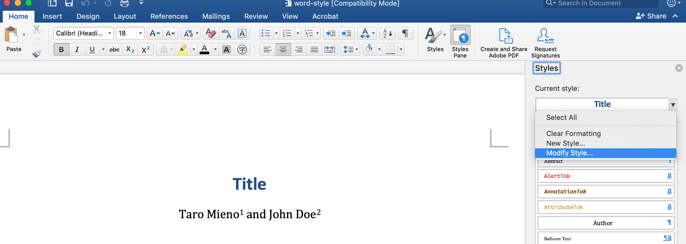

class: middle

```{r, child = './../setup.Rmd'}
```

```{r, include = F, cache = F}
suppressMessages(library(nycflights13)) 
suppressMessages(library(extrafont)) 
suppressMessages(library(patchwork))
```

# Learning objectives

Learn how to use a combination of R packages to generate (mostly) publication-ready articles in WORD 

<br>

<span style="color:red"> Tips: </span>hitting letter "o" key will give you a panel view of the slides

---
class: middle

# Before you start 

+ This lecture slides assume basic knowledge on how to use Rmarkdown. See [here](https://bookdown.org/yihui/rmarkdown/) first if are not familiar with Rmarkdown.

+ Go [here](https://www.dropbox.com/sh/7dccenk0f03v7sq/AADTO0UpSjuD4y3T4KDyTQgia?dl=0) and download all the files including sample_to_word.Rmd (a sample Rmarkdown file).

---
class: middle

# Steps 

Here are the proposed steps to generate a fully publication-ready article: 

+ Write an Rmarkdown file and knit to a WORD file (the focus of this lecture)
  * regular texts
  * R codes for analysis, tables, figures

+ Do final formatting jobs on the output WORD file (not discussed here) to the specific needs required by the final destination of the article

---
class: middle

# Why Rmarkdown-WORD?

+ No manual copying and pasting of tables and figures

+ No manual formatting of tables and figures when they get updated in the course of your research projects

+ No manual updating of data-driven numbers (e.g., coefficient estimates, summary numbers) in text

---
class: middle

# What can you do with Rmarkdown-WORD?

+ include (run) R codes to
  * run statistical or modeling analysis  
  * create figures (e.g., the `ggplot2` package)
  * create tables (e.g., the `modelsummary` and `flextable` packages)

+ refer to the R objects generated (data, tables, figures) to place them in the output WORD file 

+ cross-reference tables and figures using special syntaxes

+ create citations and a reference list automatically using special syntaxes 

+ format citation and reference styles using [Citation Style Language](https://citationstyles.org/)  

+ use Latex math syntax to write equations 

+ use markdown syntax for formatting the output WORD file 
  * headings
  * footnotes

--

.content-box-red[**Challenges**]

It is impossible to include track changes!

---
class: inverse, center, middle
name: user-defined-function

# YAML header

<html><div style='float:left'></div><hr color='#EB811B' size=1px width=1000px></html>

---
class: middle

In the YAML header, you can add 

+ `title`
+ `authors`
+ `date`
+ `abstract`

.content-box-green[**Direction**]

Take a look at these entries in the YAML header in sample_to_word.Rmd and check how they appear on sample_to_word.docx 

---
class: middle

In the YAML header, include the lines below

```{r eval = F}
output:
  bookdown::word_document2: 
```

to direct R to knit an Rmd file to a WORD file using `bookdown::word_document2` building process.

Note: `bookdown::word_document2` is used instead of `word_document:` as it allows us to easily cross-reference tables and figure. 

--

Note: We also specify bibliography and style reference files in the YAML header as we will see later.

---
class: middle

As we will see later, the YAML header also 

---
class: inverse, center, middle
name: user-defined-function

# WORD Structure and Formatting

<html><div style='float:left'></div><hr color='#EB811B' size=1px width=1000px></html>

---
class: middle

# Section, subsection, subsubsections

Use `#`, `##`, `###` at the beginning of the line to define sections, subsections, and subsubsections.

.content-box-green[**Example**]

```{r eval = F}
# This becomes section title  

## This becomes subsection title  

### This becomes subsubsection title  
```

.content-box-green[**Direction**]

Confirm that `# Materials and Methods` and `## Data` in sample_to_word.Rmd turn into a section and subsection title in sample_to_word.docx.

---
class: middle

# Footnote

.content-box-green[**How**]

You can add a footnote using `^[]` like this:

```{r eval = F}
regular texts^[this is a footnote]
```

Footnotes are automatically numbered.

.content-box-green[**Direction**]

See the Conclusion section of the sample Rmd file and output WORD file. 

---
class: middle

# Specifying the style 

Rmarkdown itself is very limited in its ability to specify the style of the output WORD file .red[syntactically].   

Few exceptions are:

+ bold font: `**this becomes bold**` (or `__this becomes bold__`)
+ italic font: `*this becomes italic*` 

Confirm this by comparing the first sentence in the Introduction section of the sample Rmd and WORD files.

---
class: middle

However, you can define the style of the output WORD file in detail using a style reference WORD file.

.content-box-green[**Example**]

font size and family for different parts of a WORD file (e.g., section, subsection, footnote)

---
class: middle

.content-box-green[**How**]

+ Create a reference word file (here, it's called "word-style.docx") that follows the style you would like the output WORD file to have

+ Add the following to the YAML header

```{r eval = F}
output:
  bookdown::word_document2:
    reference_docx: word-style.docx #<< 
```

.red[Important]: only the style of the style reference WORD file will be inherited to the output WORD file, but not its contents 

---
class: middle

.content-box-green[**Direction**]

+ See the style of "sample_to_word.dcox"

+ Open "word-style.docx" and confirm the style of the file

+ Uncomment `reference_docx: word-style.docx` to the YAML header, knit to a WORD file, and check the style of "sample_to_word.dcox"

---
class: middle

You can change the style of the reference WORD style file and save the changes. Then, the style changes will be reflected in the output WORD file.

```{r  echo = F, out.width = "60%"}
 
```

See [here](https://bookdown.org/yihui/rmarkdown-cookbook/word-template.html) for more on how to create a WORD style template. 

---
class: middle

# Tips 

.content-box-green[**Line break**]

````markdown
<br>
````

Make sure you have empty space above and below `<br>` (see the bottom entry of [this page](https://stackoverflow.com/questions/43239868/add-blank-line-to-word-output-rmarkdown)).

.content-box-green[**Direction**]

See the Materials and Methods section of the Rmd and its output WORD files.

---
class: middle

.content-box-green[**Page break (hacky)**]

+ Use `#####` to create a page break. 

+ This is only possible because I have configured the `word-style.docx` so that `#####` create a line break

+ See [here](https://datascienceplus.com/r-markdown-how-to-insert-page-breaks-in-a-ms-word-document/) if you want to create your own syntax to generate a page break on your own reference style docx file. (just build on the word-style.docx file I provided if you do not want to bother to do it)

+ Note that this method will leave the texts after `#####` in white (that's why you cannot see the texts). If you do not like this, simply do not use this syntax to include page breaks.

--

.content-box-green[**Direction**]

+ Check just above the Materials and Methods section in the Rmd file and confirm that there is a line that starts with `#####` 

+ Confirm that a page break indeed happened right before the Materials and Methods section

---
class: inverse, center, middle
name: user-defined-function

# Citations and References

<html><div style='float:left'></div><hr color='#EB811B' size=1px width=1000px></html>

---
class: middle

# Add Citations and References

.content-box-green[**How**]

+ Create a reference file (here, "bibliography.bib")

+ Add the following to the YAML header (see the sample Rmd file for an example)

```{r eval = F}
bibliography: bibliography file name
```

+ Add `<div id="refs"></div>` in the Reference section (see the sample Rmd file)

---
class: middle

.content-box-green[**Syntax**]

+ use `@reference_name` to print "author names (year)" in the output WORD file

+ use `[@reference_name]` to print "(author names, year)" in the output WORD file 

+ use `[@reference_name_1; @reference_name_2]` to print "(author names, year; author names, year)" in the output WORD file 

+ use `[-@reference_name]` to print just year

---
class: middle

.content-box-green[**Direction**]

See the Introduction and Reference sections in the sample RMD file and its output WORD file.

---
class: middle

Other bibliography systems can be used:

```{r echo = F}
data.frame(
  format = c("CSL-JSON","MODS","BibLaTeX","BibTeX","RIS","EndNote","EndNote XML","ISI","MEDLINE","Copac"),
  extension = c(".json", ".mods", ".bib", ".bibtex", ".ris", ".enl", ".xml", ".wos", ".medline", ".copac")
) %>% 
flextable() %>% 
fontsize(size = 18, part = "all") %>% 
autofit()
```

---
class: middle

# Citation and Reference Style 

You can change the citation and reference style using [Citation Style Language](https://citationstyles.org/).

--

.content-box-green[**How**]

+ Obtain the csl file you would like to use from the [Zotero citation style repository](https://www.zotero.org/styles).

+ Place the following in the YAML header (see the YAML header of sample_to_word.Rmd for an example):

```{r eval = F}
csl: csl file name 
```

+ Then, when knitted, citations and references styles reflect what the style specified by the csl file  

---
class: middle

.content-box-green[**Direction**]

+ Check the current citation and reference style of sample_to_word.docx

+ uncomment `# csl: agronomy.csl` in the YAML header 

+ knit and confirm the changes in the citation and reference styles

---
class: inverse, center, middle
name: user-defined-function

# Tables and Figures

<html><div style='float:left'></div><hr color='#EB811B' size=1px width=1000px></html>

---
class: middle

# Tables

.content-box-green[**How**]

+ Create a table using the `flextable` package (this is not the only option) 

+ Add an R code chunk like this:
  * `table_ft` is a `flextable` object.
  * `table-name` is the chunk name

````markdown
`r ''````{r table-name}
  table_ft
```
````

+ Use `\@ref(tab:table-name)` in the rmarkdown file to cross-reference the table (table numbering in the output WORD file is automatic)

+ .red[Caveat]: You cannot use `_` in the chunk name (`-` is allowed). Cross-referencing would not work with chunk names that include `_`.

---
class: middle

.content-box-green[**Direction**]

See the Table section in "sample_to_word.Rmd" and its output WORD file. 

---
class: middle

# Figures

.content-box-green[**How**]

+ Create a figure using the `ggplot2` package (this is not the only option) 

+ Add an R code chunk like this:
  * `figure_g` is a `ggplot2` object.
  * `figure-name` is the chunk name
  * `fig.cap = "caption"` adds `caption` as the caption of the figure 

````markdown
`r ''````{r figure-name, fig.cap = "caption"}
  figure_g 
```
````

+ Use `\@ref(fig:figure-name)` in the rmarkdown file to cross-reference the figure (figure numbering in the output WORD file is automatic)

+ .red[Caveat]: You cannot use `_` in the chunk name (`-` is allowed). Cross-referencing would not work with chunk names that include `_`.

---
class: middle

.content-box-green[**Direction**]

See the Figure section in "sample_to_word.Rmd" and its output WORD file. 

---
class: inverse, center, middle
name: user-defined-function

# Mathematical equations

<html><div style='float:left'></div><hr color='#EB811B' size=1px width=1000px></html>

---
class: middle

You can use Latex.red[-like] math syntax to write mathematical equations.

.content-box-green[**Examples**]

````markdown
$Y_z = f_z(S) + g_z(N) + h_z(X,Y) + \varepsilon_z$
````

$Y_z = f_z(S) + g_z(N) + h_z(X,Y) + \varepsilon_z$

````markdown
$\bar{x} = \frac{\sum_{i=1}^n x_i}{n}$
````

$\bar{x} = \frac{\sum_{i=1}^n x_i}{n}$

````markdown
$$
\begin{aligned}
 AR(p): Y_i &= c + \epsilon_i + \phi_i Y_{i-1} \dots \\
 Y_{i} &= c + \phi_i Y_{i-1} \dots
\end{aligned}
$$
````

$$
\begin{aligned}
 AR(p): Y_i &= c + \epsilon_i + \phi_i Y_{i-1} \dots \\
 Y_{i} &= c + \phi_i Y_{i-1} \dots
\end{aligned}
$$

---
class: middle

.content-box-red[**Caveat**]

+ When knitted to WORD, Latex is .red[NOT] involved in converting Latex.red[-like] math syntax to math equations. Instead, pandoc is doing the conversion job.

+ So, it is not surprising that not all the Latex math capabilities can be utilized when knitting to a WORD file. 

+ For example, the math written in an "align" environment does not print in the output WORD file even though it prints the equations on RStudio.  

+ With that said, many of the syntaxes that you will need are the same between Rmd-to-WORD and Latex.   

---
class: middle

.content-box-green[**Direction**]

+ Confirm that the equations (in the Statistical Model subsection) written in the "aligned" and "align" environments are both correctly printed below on RStudio (RStudio can interpret them)

+ Now, knit to a WORD file and confirm that the equations from the "align" environment do not appear in the WORD document 

---
class: middle

# Equation numbering and cross-reference 

By default, equation numbering is not supported with `bookdown::word_document2`.

In order to number and cross-reference equations automatically, we can use `pandoc-crossref` (see [here](https://stackoverflow.com/questions/47985267/equation-numbering-in-rmarkdown-for-export-to-word) for how to install it). 


.content-box-green[**How**]

Place `{#eq:equation-name}` after an equation like this:

```{r eval = F}
$$y = \beta_0 + \beta_1 x + \varepsilon$$ {#eq:eqn1}  
```

We can then cross-reference the equation with [@eq:equation-name].

.red[Note]: do not forget `eq:`

---
class: middle

.content-box-green[**Direction**]

+ Look at the Statistical Model section of the sample Rmd and WORD file to see examples.

+ As you can see in the sample WORD file, `eq. ` is added to the cross-referenced equation number.

---
class: middle

.content-box-green[**Changing the prefix**]

In order to change the prefix, put this in the YAML header:

```{r eval = F}
eqnPrefix:
  - "prefix you like"
```

--

.content-box-green[**Direction**]

+ Uncomment the following lines in the YAML header of the sample Rmd file and knit 

```{r }
# eqnPrefix:
#   - "Equation" 
```

+ Confirm that the prefix for the first equation has changed 

---
class: middle

.content-box-green[**Suppress prefix**]

In order to just have equation number, put `-` in front of `@` like this:

```{r eval = F}
[-@eq:eqn2]
``` 

--

.content-box-green[**Direction**]

Confirm that the prefix of the second equation is gone (only equation number). 

---
class: middle

.content-box-green[**Creating white space**]

Sometimes, you need to insert white space inside equations. You can use the following syntax to achieve that:

* `\quad`: space equal to the current font size 
* `\,`: 3/18 of \quad 
* `\:`: 4/18 of \quad 
* `\;`:5/18 of \quad 
* `\qquad`: twice of \quad (= 36 mu) 


